# PRISM — 公共卫生间智慧清洁管理系统

> **P**ublic **R**estroom **I**ntelligent **S**anitation **M**anagement
>
> 文档版本：v0.1.0 | 创建日期：2026-03-05 | 状态：草案

---

## 1. 项目背景

公共卫生间是城市公共基础设施的重要组成部分，广泛存在于商场、地铁站、火车站、机场、公园、写字楼等场所。其清洁管理直接关系到市民出行体验、城市形象和公共卫生安全。

当前痛点：

| 痛点类别 | 具体表现 |
|---------|---------|
| 管理粗放 | 依赖固定排班，无法根据实际使用量动态调度 |
| 响应滞后 | 设备故障、耗材缺失需人工巡查才能发现 |
| 质量难控 | 清洁标准主观性强，缺乏量化验收机制 |
| 数据缺失 | 无法沉淀运营数据，难以做成本优化和趋势分析 |
| 体验薄弱 | 使用者投诉渠道单一，缺少实时互动反馈 |

## 2. 项目目标

构建一套面向**公共卫生间场景**的智慧清洁管理平台，实现：

1. **实时感知** — 通过 IoT 传感器采集人流量、环境指标、耗材余量等数据
2. **智能调度** — 基于数据驱动的动态清洁排班与任务派发
3. **质量闭环** — 清洁前后对比、AI 质检、主管复核的三级质量管控
4. **公众参与** — 扫码评价 / 一键报修 / 满意度调研
5. **数据决策** — 多维度看板、成本分析、趋势预测

## 3. 项目总体流程

```mermaid
flowchart TB
    subgraph Phase1["阶段一：立项与规划"]
        A1["市场调研与背景分析"] --> A2["需求收集<br/>（甲方/用户/运维）"]
        A2 --> A3["需求分析与整理"]
        A3 --> A4["可行性分析"]
        A4 --> A5{"立项评审<br/>是否通过？"}
        A5 -->|否| A3
        A5 -->|是| A6["项目立项"]
    end

    subgraph Phase2["阶段二：需求与设计"]
        A6 --> B1["功能梳理与模块划分"]
        B1 --> B2["非功能需求定义"]
        B2 --> B3["技术选型与架构设计"]
        B3 --> B4["原型设计 & UI/UX"]
        B4 --> B5["需求评审"]
        B5 --> B6{"评审通过？"}
        B6 -->|否| B1
        B6 -->|是| B7["需求基线锁定"]
    end

    subgraph Phase3["阶段三：开发与测试"]
        B7 --> C1["迭代计划制定"]
        C1 --> C2["Sprint 开发"]
        C2 --> C3["单元测试 & 代码评审"]
        C3 --> C4["集成测试"]
        C4 --> C5["系统测试 & UAT"]
        C5 --> C6{"测试通过？"}
        C6 -->|否| C2
        C6 -->|是| C7["版本封板"]
    end

    subgraph Phase4["阶段四：部署与交付"]
        C7 --> D1["预生产环境部署"]
        D1 --> D2["灰度发布"]
        D2 --> D3["全量上线"]
        D3 --> D4["用户培训"]
        D4 --> D5["项目验收"]
    end

    subgraph Phase5["阶段五：运营与演进"]
        D5 --> E1["运维监控"]
        E1 --> E2["用户反馈收集"]
        E2 --> E3["数据分析与优化"]
        E3 --> E4["版本迭代"]
        E4 --> E1
    end

    style Phase1 fill:#e8f5e9,stroke:#2e7d32
    style Phase2 fill:#e3f2fd,stroke:#1565c0
    style Phase3 fill:#fff3e0,stroke:#e65100
    style Phase4 fill:#f3e5f5,stroke:#6a1b9a
    style Phase5 fill:#fce4ec,stroke:#b71c1c
```

## 4. 文档索引

| 序号 | 文档名称 | 说明 |
|------|---------|------|
| 00 | 项目概述与总体流程（本文档） | 项目背景、目标、总体流程 |
| 01 | [需求分析](./01-需求分析.md) | 利益相关方、用户故事、需求清单 |
| 02 | [可行性分析](./02-可行性分析.md) | 技术/经济/操作/法律可行性 |
| 03 | [功能梳理](./03-功能梳理.md) | 功能模块树、核心业务流程 |
| 04 | [技术选型](./04-技术选型.md) | 架构方案、技术栈对比、选型决策 |
| 05 | [项目规划与里程碑](./05-项目规划与里程碑.md) | WBS、里程碑、资源计划 |

## 5. 术语表

| 术语 | 全称 / 解释 |
|------|------------|
| PRISM | Public Restroom Intelligent Sanitation Management |
| IoT | Internet of Things，物联网 |
| UAT | User Acceptance Testing，用户验收测试 |
| SLA | Service Level Agreement，服务等级协议 |
| OTA | Over-The-Air，空中升级 |
| MTBF | Mean Time Between Failures，平均故障间隔 |

---

> 下一步：请阅读 [01-需求分析](./01-需求分析.md)
