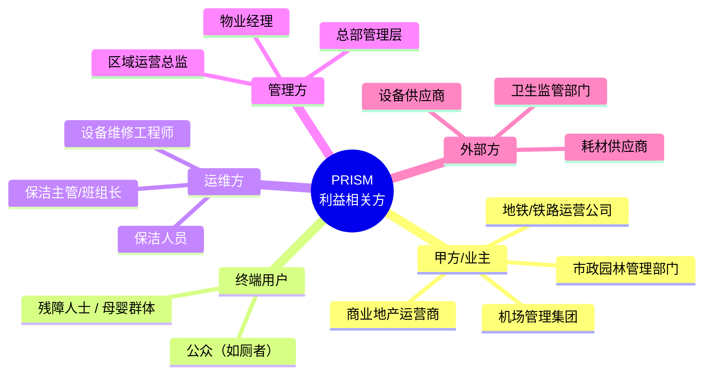
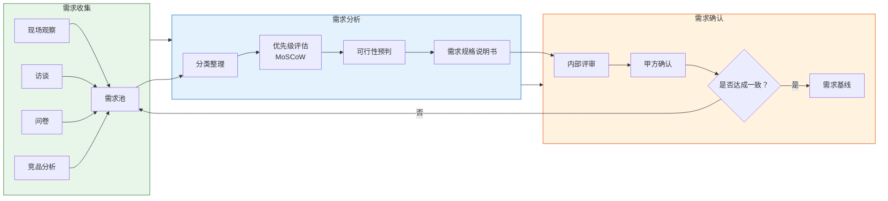
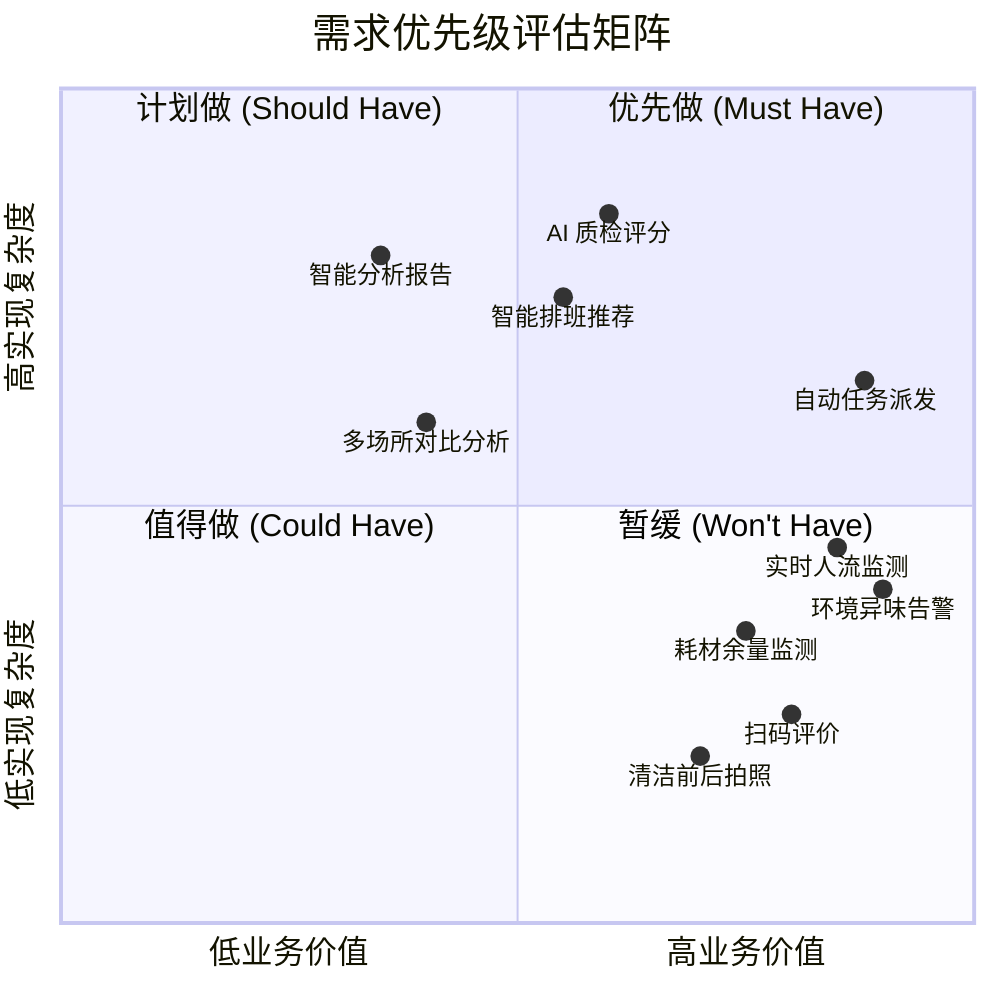

# 01 — 需求分析

> 文档版本：v0.1.0 | 创建日期：2026-03-05 | 状态：草案

---

## 1. 利益相关方分析

## 2. 需求收集方法

| 方法 | 对象 | 目标 |
|------|------|------|
| 现场观察 | 3-5 个典型场所（商场/地铁/火车站） | 了解清洁流程现状、痛点 |
| 深度访谈 | 物业经理、保洁主管、保洁员 | 挖掘管理与操作层面需求 |
| 问卷调研 | 公众用户（500+ 份） | 获取满意度、投诉热点 |
| 竞品分析 | 国内外 3-5 款类似产品 | 功能对标、差异化定位 |
| 政策研读 | 《城市公厕管理办法》等法规 | 合规性需求 |

## 3. 用户画像

### 3.1 保洁人员（张阿姨，52 岁）

- **背景**：某商场保洁员，负责 2 层共 4 间卫生间
- **日常**：按固定时间表巡查清洁，手写签到
- **痛点**：高峰时段忙不过来，低峰时段空等；耗材用完才知道补货
- **期望**：手机提醒什么时候该打扫，自动统计工作量

### 3.2 保洁主管（李班长，38 岁）

- **背景**：管理 15 名保洁员，覆盖整栋商场
- **日常**：排班、巡查、处理投诉、填写日报
- **痛点**：不知道哪个卫生间最需要清洁；人手调配全凭经验；月底汇总数据费时
- **期望**：实时看到各卫生间状态，自动排班建议，一键导出报表

### 3.3 物业经理（王总，45 岁）

- **背景**：负责商场整体物业运营
- **日常**：管理多个业务线，关注成本和满意度指标
- **痛点**：保洁成本逐年上升但服务质量难以量化评估
- **期望**：清洁成本可视化、满意度趋势、对标行业标杆

### 3.4 公众用户（市民小赵，28 岁）

- **背景**：通勤族，每天经过地铁站
- **痛点**：遇到脏乱差卫生间无处投诉；不知道附近哪间卫生间可用
- **期望**：扫码反馈、查看卫生间实时状态

## 4. 用户故事地图

### 用户故事清单

#### Epic 1：实时监测

| ID | 用户故事 | 优先级 | 验收标准 |
|----|---------|--------|---------|
| US-101 | 作为**保洁主管**，我希望实时查看每间卫生间的人流量，以便识别高峰时段 | P0 | 人流数据每 5 分钟更新一次，延迟 ≤ 30 秒 |
| US-102 | 作为**保洁主管**，我希望监测卫生间空气质量（氨气/硫化氢），以便及时安排清洁 | P0 | 异味超标后 1 分钟内触发告警 |
| US-103 | 作为**设备工程师**，我希望实时监测水电设备状态，以便预防性维护 | P1 | 漏水/断电事件 30 秒内告警 |
| US-104 | 作为**保洁主管**，我希望监测纸巾/洗手液余量，以便提前备货 | P0 | 余量 ≤ 20% 时自动提醒 |
| US-105 | 作为**保洁主管**，我希望查看卫生间实时占用率，以便选择合适时间清洁 | P1 | 坑位占用数据实时更新 |

#### Epic 2：智能调度

| ID | 用户故事 | 优先级 | 验收标准 |
|----|---------|--------|---------|
| US-201 | 作为**保洁主管**，我希望系统根据人流和环境数据自动生成清洁任务，以便替代经验排班 | P0 | 任务生成响应时间 ≤ 1 分钟 |
| US-202 | 作为**保洁员**，我希望在手机上收到清洁任务推送，以便知道下一步该做什么 | P0 | 推送到达率 ≥ 99% |
| US-203 | 作为**保洁主管**，我希望系统推荐最优人员分配方案，以便提高效率 | P1 | 考虑距离、工作量、技能等因素 |
| US-204 | 作为**保洁主管**，我希望处理突发任务（用户报修/投诉），以便快速响应 | P0 | 突发任务 5 分钟内派单 |

#### Epic 3：清洁执行

| ID | 用户故事 | 优先级 | 验收标准 |
|----|---------|--------|---------|
| US-301 | 作为**保洁员**，我希望通过手机扫码签到/签退，以便记录工作时间 | P0 | 支持离线签到，网络恢复后自动同步 |
| US-302 | 作为**保洁员**，我希望按照标准化清洁步骤 checklist 操作，以便保证质量 | P1 | checklist 可由管理员自定义 |
| US-303 | 作为**保洁员**，我希望拍照记录清洁前后对比，以便存档和质检 | P0 | 照片自动关联时间/地点/任务 |
| US-304 | 作为**保洁员**，我希望上报设备故障，以便及时维修 | P1 | 故障工单自动创建并通知工程师 |

#### Epic 4：质量管控

| ID | 用户故事 | 优先级 | 验收标准 |
|----|---------|--------|---------|
| US-401 | 作为**保洁主管**，我希望通过 AI 对比清洁前后照片评估清洁质量，以便客观打分 | P1 | 评分准确率 ≥ 85% |
| US-402 | 作为**保洁主管**，我希望对不合格清洁进行驳回并要求返工，以便保证标准 | P0 | 返工任务 10 分钟内重新派发 |
| US-403 | 作为**物业经理**，我希望定期抽查并打分，以便监督管理 | P1 | 支持随机抽查和定向抽查 |
| US-404 | 作为**公众用户**，我希望扫码评价卫生间清洁度，以便表达满意或不满 | P0 | 评价提交后 5 秒内可查 |

#### Epic 5：数据分析与决策

| ID | 用户故事 | 优先级 | 验收标准 |
|----|---------|--------|---------|
| US-501 | 作为**物业经理**，我希望查看清洁成本分析看板，以便优化预算 | P1 | 人力/耗材/设备成本分类统计 |
| US-502 | 作为**区域总监**，我希望对比不同场所的运营指标，以便推广最佳实践 | P2 | 支持多维度横向对比 |
| US-503 | 作为**物业经理**，我希望查看满意度趋势，以便评估改进效果 | P0 | 日/周/月多粒度趋势图 |
| US-504 | 作为**管理层**，我希望获得智能分析报告，以便辅助决策 | P2 | 自动识别异常指标并给出建议 |

## 5. 非功能需求

| 类别 | 需求描述 | 指标 |
|------|---------|------|
| **性能** | 系统响应时间 | 页面加载 ≤ 2s，API 响应 ≤ 500ms |
| **并发** | 支持同时在线用户数 | ≥ 5000 |
| **可用性** | 系统可用率 | ≥ 99.9%（年宕机 ≤ 8.76 小时） |
| **安全** | 数据安全 | 传输加密（TLS 1.3）、存储加密、RBAC 权限控制 |
| **隐私** | 个人信息保护 | 符合《个人信息保护法》，公众使用不采集身份信息 |
| **兼容性** | 终端支持 | iOS 14+、Android 10+、Chrome/Edge/Firefox 最新两版 |
| **可扩展** | 多场所接入 | 支持 SaaS 多租户，单租户可管理 ≥ 500 间卫生间 |
| **离线** | 弱网/断网支持 | 保洁端 APP 支持离线作业，恢复后自动同步 |
| **国际化** | 多语言 | 首版支持中文，架构预留多语言扩展能力 |

## 6. 需求分析流程

## 7. 需求优先级矩阵（MoSCoW）

---

> 上一篇：[00-项目概述与总体流程](./00-项目概述与总体流程.md) | 下一篇：[02-可行性分析](./02-可行性分析.md)
