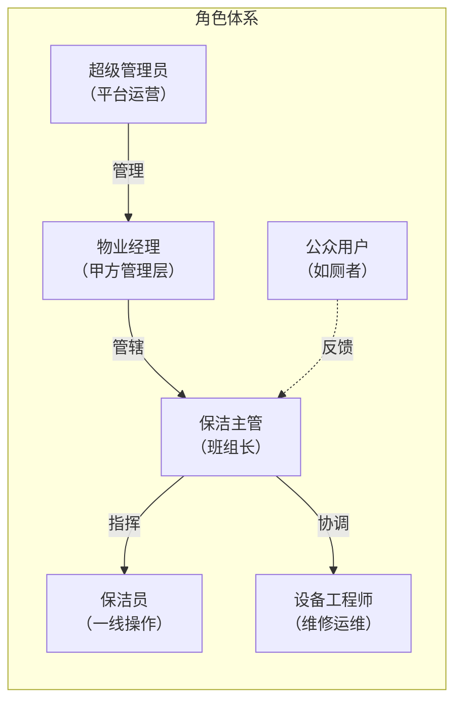
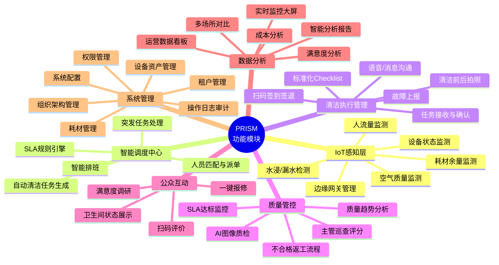
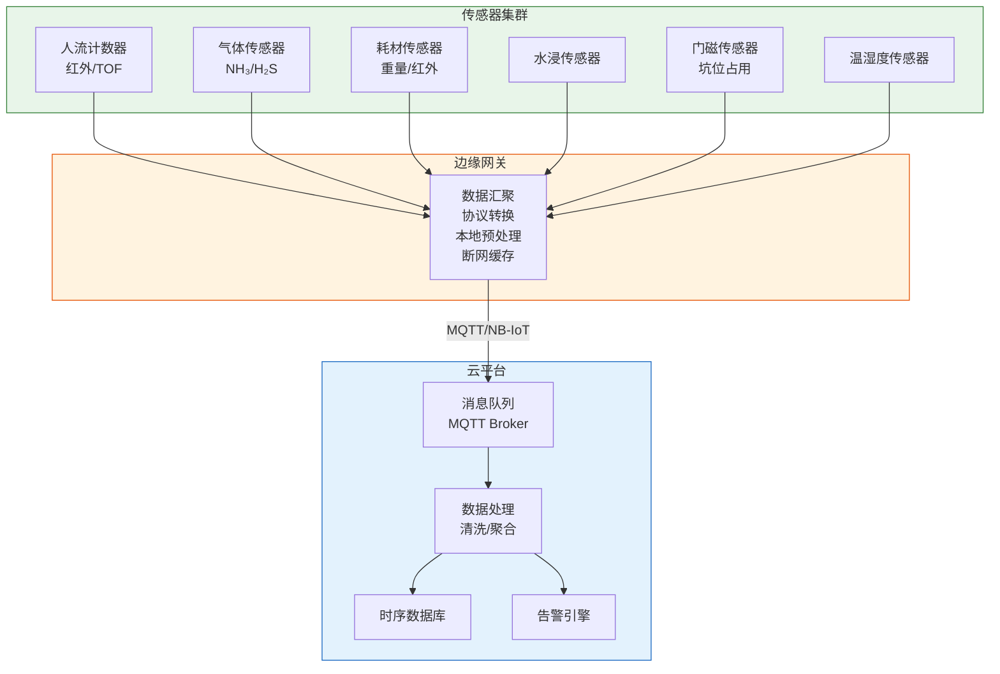
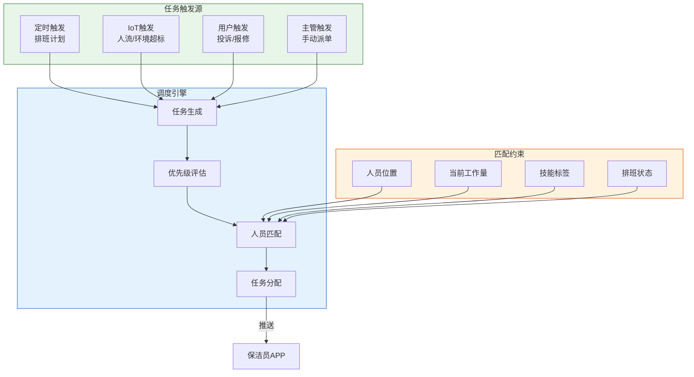
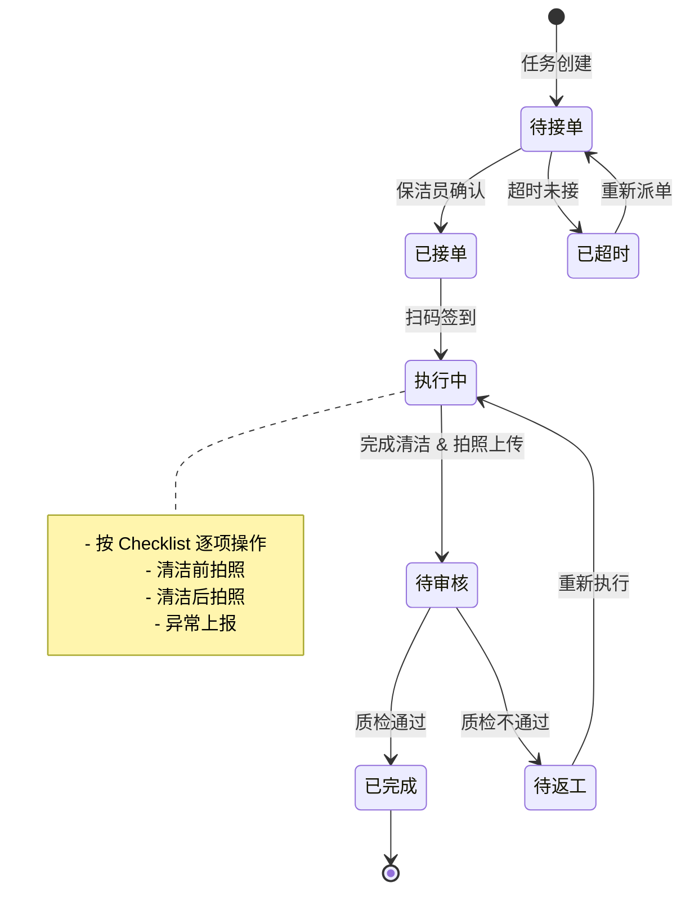
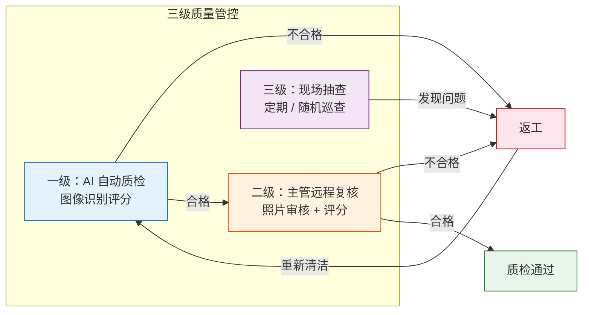
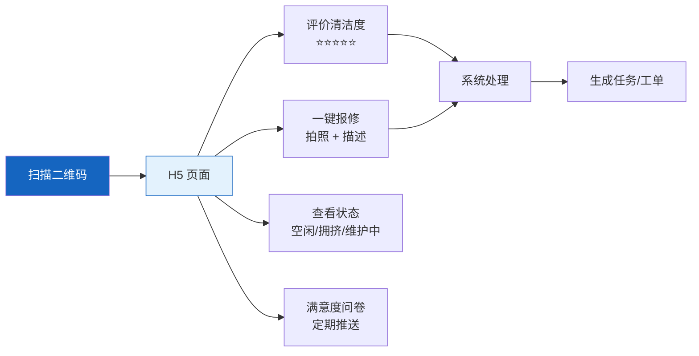
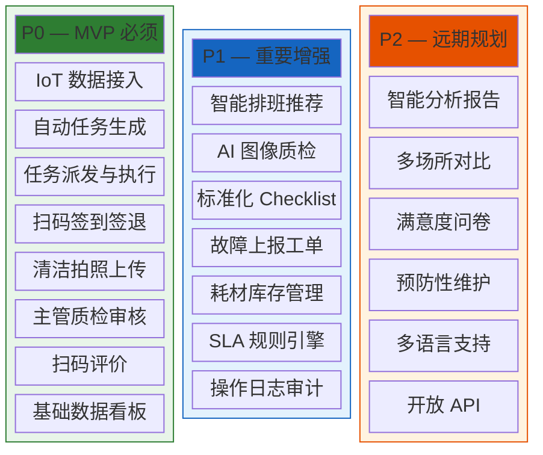
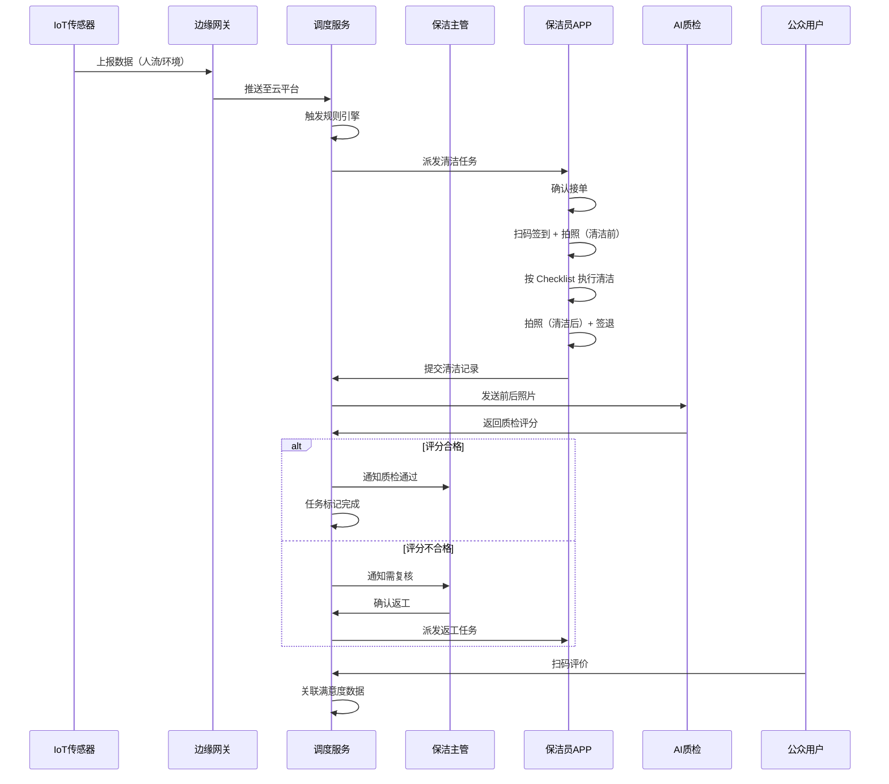
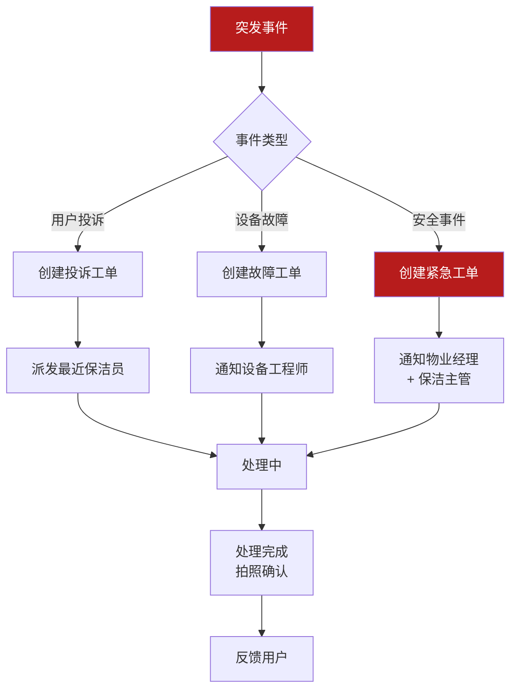

# 03 — 功能梳理

> 文档版本：v0.1.0 | 创建日期：2026-03-05 | 状态：草案

---

## 1. 系统角色定义

| 角色 | 终端 | 核心权限 |
|------|------|---------|
| 超级管理员 | Web 管理后台 | 租户管理、系统配置、全局数据 |
| 物业经理 | Web 后台 + 手机端 | 场所管理、数据看板、报表导出 |
| 保洁主管 | Web 后台 + 手机端 | 排班、派单、质检、巡查 |
| 保洁员 | 手机端（APP / 小程序） | 接单、签到、执行、上报 |
| 设备工程师 | 手机端 | 故障处理、设备维护 |
| 公众用户 | 微信扫码 H5 | 评价、报修、查看状态 |

---

## 2. 功能模块总览

---

## 3. 核心模块详细功能

### 3.1 IoT 感知层

| 功能 | 描述 | 采集频率 | 告警规则 |
|------|------|---------|---------|
| 人流计数 | 统计进出人次，计算累计使用量 | 实时（事件驱动） | 累计 N 人次后触发清洁任务 |
| 空气质量 | 监测 NH₃、H₂S、VOC 浓度 | 30 秒 | 浓度超阈值连续 2 次告警 |
| 耗材余量 | 纸巾卷余量、皂液余量 | 5 分钟 | 余量 ≤ 20% 提醒、≤ 5% 紧急 |
| 水浸检测 | 地面积水、管道漏水 | 实时（事件驱动） | 触发即告警 |
| 坑位占用 | 各隔间是否有人使用 | 实时（事件驱动） | 用于状态展示，非告警 |
| 温湿度 | 环境舒适度 | 1 分钟 | 超出舒适范围提醒（可选） |

### 3.2 智能调度中心

| 功能 | 描述 | 业务规则 |
|------|------|---------|
| 排班管理 | 支持周/月排班，可手动调整 | 考虑休假、加班、换班 |
| 自动任务生成 | 根据传感器数据自动创建清洁任务 | 可配置触发规则（人流量/时间/环境） |
| 智能派单 | 基于距离、工作量、技能自动匹配最优人员 | 支持手动覆盖 |
| 突发响应 | 处理用户投诉、设备故障等紧急事件 | 优先级高于常规任务 |
| SLA 引擎 | 定义清洁响应时间、完成时间标准 | 超时自动升级通知 |

### 3.3 清洁执行管理

| 功能 | 描述 | 关键设计 |
|------|------|---------|
| 任务接收 | 推送 + 列表查看待办任务 | 支持抢单/指派两种模式 |
| 扫码签到 | 扫描卫生间门口二维码签到 | GPS + 二维码双重校验；支持离线 |
| Checklist | 标准化清洁步骤引导 | 管理员可按卫生间类型自定义 |
| 拍照上传 | 清洁前后对比照片 | 强制拍照、EXIF 校验防篡改 |
| 耗材补充 | 记录补充的耗材种类和数量 | 关联库存消耗 |
| 故障上报 | 发现设备故障一键上报 | 自动创建维修工单 |
| 签退完成 | 确认所有步骤完成后签退 | 自动计算清洁耗时 |

### 3.4 质量管控

### 3.5 公众互动

### 3.6 数据分析与看板

| 看板类型 | 核心指标 | 使用角色 |
|---------|---------|---------|
| 实时大屏 | 各卫生间实时状态、人流热力图、告警信息 | 保洁主管、物业经理 |
| 运营看板 | 任务完成率、平均响应时间、SLA 达标率 | 保洁主管、物业经理 |
| 质量看板 | 质检通过率、返工率、评分分布 | 保洁主管、物业经理 |
| 满意度看板 | 评价星级分布、趋势变化、Top 投诉 | 物业经理、区域总监 |
| 成本看板 | 人力成本、耗材消耗、设备维护费 | 物业经理、管理层 |
| 对比分析 | 多场所横向对比、环比/同比趋势 | 区域总监、管理层 |

### 3.7 系统管理

| 功能 | 描述 |
|------|------|
| 多租户管理 | SaaS 模式下隔离不同物业公司数据 |
| 组织架构 | 公司 → 项目/场所 → 区域 → 卫生间的层级管理 |
| 权限管理 | 基于 RBAC 的细粒度权限控制 |
| 设备管理 | 设备台账、生命周期、固件升级 |
| 耗材管理 | 耗材品类、库存、消耗记录、采购建议 |
| 通知管理 | 通知模板、渠道配置（APP 推送/短信/企微） |
| 操作日志 | 全链路操作审计日志 |

---

## 4. 功能优先级分级

---

## 5. 核心业务流程

### 5.1 完整清洁作业流程

### 5.2 突发事件处理流程

---

> 上一篇：[02-可行性分析](./02-可行性分析.md) | 下一篇：[04-技术选型](./04-技术选型.md)
