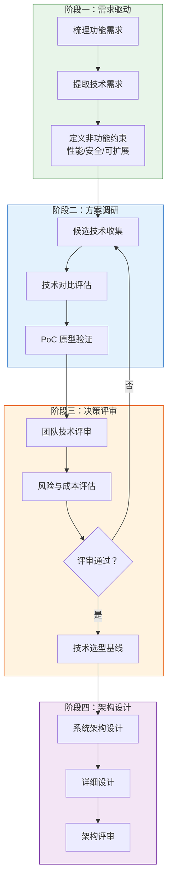
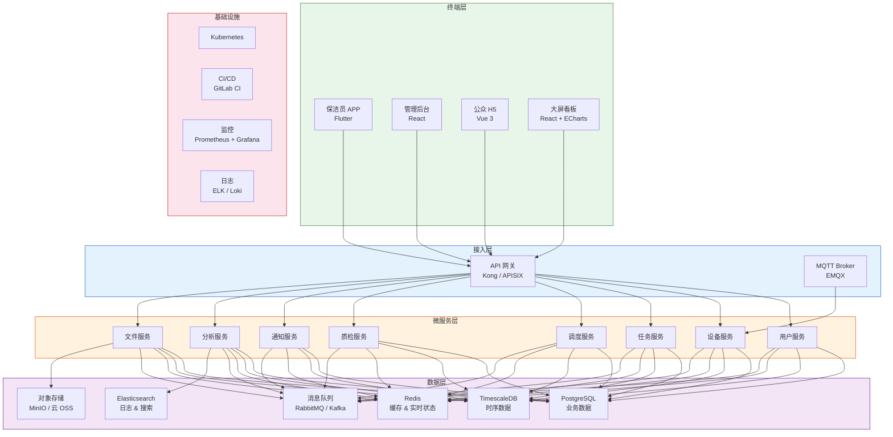
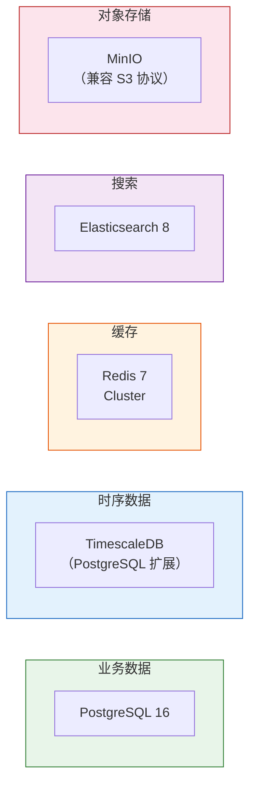
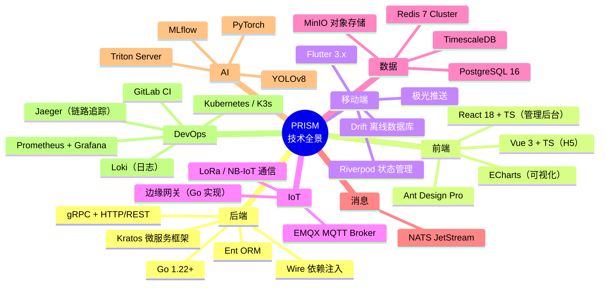

# 04 — 技术选型

> 文档版本：v0.1.0 | 创建日期：2026-03-05 | 状态：草案

---

## 1. 技术选型流程

---

## 2. 系统架构总览

---

## 3. 技术栈对比与选型

### 3.1 后端语言与框架

```mermaid
xychart-beta
    title "后端技术栈综合评分（满分 10）"
    x-axis ["生态成熟度", "开发效率", "性能", "招聘难度", "运维成本", "社区活跃度"]
    y-axis "评分" 0 --> 10
    bar "Go + Gin/Kratos" [7, 8, 9, 6, 8, 8]
    bar "Java + Spring Cloud" [10, 6, 7, 9, 6, 9]
    bar "Node.js + NestJS" [8, 9, 8, 7, 7, 8]
```

| 维度 | Go + Gin/Kratos | Java + Spring Cloud | Node.js + NestJS |
|------|----------------|--------------------|--------------------|
| **生态成熟度** | 中高 — IoT/云原生生态强 | 高 — 企业级生态最完善 | 中高 — Web 生态强 |
| **开发效率** | 高 — 语法简洁，编译快 | 中 — 较多样板代码 | 高 — 前后端统一 |
| **性能** | 高 — 原生并发，低内存 | 中高 — JVM 预热慢 | 中高 — 异步 IO 强 |
| **招聘难度** | 中等 | 低 — 人才池最大 | 中低 |
| **适合场景** | 高并发微服务、IoT | 大型企业级系统 | 全栈、实时应用 |

**选型决策**：**Go（Kratos 框架）**

理由：
1. IoT 数据接入场景需要高并发低延迟，Go 天然优势
2. 容器化部署体积小，资源消耗低，降低云服务成本
3. Kratos 是 B 站开源的微服务框架，适合国内团队，文档中文化好
4. 编译型语言，无需 JVM，冷启动快

### 3.2 前端技术栈

| 维度 | React 18 + Ant Design | Vue 3 + Element Plus | Angular 17 |
|------|----------------------|---------------------|-------------|
| **管理后台适用性** | 高 — AntD Pro 成熟 | 高 — 后台方案多 | 高 — 大型项目强 |
| **H5 轻量页面** | 中 — 偏重 | 高 — 包体积小 | 低 — 过重 |
| **大屏可视化** | 高 — 配合 ECharts | 高 — 配合 ECharts | 中 |
| **团队学习成本** | 中 | 低 | 高 |
| **TypeScript 支持** | 好 | 好 | 原生 |

**选型决策**：

| 终端 | 技术栈 | 理由 |
|------|--------|------|
| 管理后台 | **React 18 + TypeScript + Ant Design Pro** | AntD Pro 的 ProTable/ProForm 大量减少后台页面开发量 |
| 公众 H5 | **Vue 3 + TypeScript + Vant** | 轻量，加载快，移动端组件丰富 |
| 大屏看板 | **React + ECharts + DataV** | ECharts 地图/图表能力强 |

### 3.3 移动端技术栈

| 维度 | Flutter | React Native | 原生（Kotlin + Swift） | 微信小程序 |
|------|---------|-------------|----------------------|-----------|
| **跨平台** | 一套代码 iOS + Android | 一套代码 | 各写一套 | 仅微信生态 |
| **性能** | 接近原生 | 中 | 最优 | 中 |
| **UI 一致性** | 高 — 自渲染 | 中 — 桥接原生 | 最高 | 中 |
| **离线能力** | 好 | 好 | 最好 | 差 |
| **热更新** | 支持（Shorebird） | 支持（CodePush） | 需发版 | 天然 |
| **开发成本** | 中 | 中 | 高（2 倍） | 低 |

**选型决策**：

| 终端 | 技术栈 | 理由 |
|------|--------|------|
| 保洁员/主管 APP | **Flutter** | 跨平台、性能好、离线支持强、UI 一致性高 |
| 公众端 | **微信 H5 页面**（非小程序） | 免安装、扫码即用、开发成本低 |

### 3.4 IoT 与通信

| 维度 | EMQX | Mosquitto | 阿里云 IoT | AWS IoT Core |
|------|------|-----------|-----------|-------------|
| **MQTT 支持** | 完整 5.0 | 完整 | 完整 | 完整 |
| **集群能力** | 强 — 千万级连接 | 弱 — 单机 | 强 | 强 |
| **规则引擎** | 内置 | 无 | 丰富 | 丰富 |
| **私有化部署** | 支持 | 支持 | 不支持 | 不支持 |
| **成本** | 开源免费 / 企业版 | 免费 | 按量付费 | 按量付费 |
| **中文支持** | 优秀 | 一般 | 优秀 | 一般 |

**选型决策**：**EMQX**

理由：
1. 国产开源，中文文档完善
2. 支持私有化部署，满足数据安全要求
3. 内置规则引擎可直接将 MQTT 消息路由到 Kafka/PostgreSQL
4. 社区活跃，千万级连接经过大规模验证

### 3.5 数据库选型

| 数据类型 | 选型 | 理由 |
|---------|------|------|
| 业务数据（用户/任务/组织） | **PostgreSQL 16** | JSONB、全文搜索、扩展生态（PostGIS 可做地理位置）；与 TimescaleDB 统一技术栈 |
| IoT 时序数据 | **TimescaleDB** | PostgreSQL 超集，无额外学习成本；自动分区、压缩，查询性能优 |
| 缓存 / 实时状态 | **Redis 7 Cluster** | 卫生间实时状态、在线设备列表、任务锁等高频读写场景 |
| 日志 / 全文检索 | **Elasticsearch 8** | 操作日志审计、全文搜索 |
| 图片 / 文件 | **MinIO** | S3 兼容、私有化部署、免供应商锁定 |

### 3.6 消息队列

| 维度 | RabbitMQ | Kafka | RocketMQ | NATS |
|------|----------|-------|----------|------|
| **吞吐量** | 万级 TPS | 百万级 TPS | 十万级 TPS | 百万级 TPS |
| **延迟** | 微秒级 | 毫秒级 | 毫秒级 | 微秒级 |
| **消息可靠** | 强 | 强 | 强 | 中 |
| **运维复杂度** | 低 | 高 | 中 | 低 |
| **适用场景** | 业务解耦 | 大数据流 | 交易型 | 微服务通信 |

**选型决策**：**NATS（JetStream）**

理由：
1. Go 原生生态，与后端语言一致
2. 运维极简，单二进制部署
3. JetStream 提供持久化消息能力，满足业务可靠性要求
4. 对于 PRISM 的规模（非海量数据流），NATS 足够且更轻量

### 3.7 AI / 机器学习

| 能力 | 选型 | 说明 |
|------|------|------|
| 图像质检模型 | **YOLOv8 + 自训练** | 检测地面污渍、垃圾、设施损坏 |
| 模型服务 | **Triton Inference Server** | GPU 推理服务，支持模型版本管理 |
| 训练平台 | **PyTorch + MLflow** | 模型训练、实验追踪、版本管理 |
| 降级方案 | 云端 API（通义千问 VL / GPT-4 Vision） | 初期训练数据不足时调用多模态大模型 |

### 3.8 DevOps / 基础设施

| 能力 | 选型 | 说明 |
|------|------|------|
| 容器编排 | **Kubernetes（K3s 轻量版可选）** | 微服务部署、弹性伸缩 |
| CI/CD | **GitLab CI / GitHub Actions** | 自动化构建、测试、部署 |
| 容器镜像 | **Harbor** | 私有镜像仓库 |
| 服务网格 | **暂不引入** | 初期服务数量 <10，gRPC 直连即可 |
| 监控 | **Prometheus + Grafana** | 指标采集、看板、告警 |
| 日志 | **Loki + Grafana** | 轻量日志聚合（替代重量级 ELK） |
| 链路追踪 | **Jaeger** | 微服务调用链追踪 |
| 配置中心 | **Nacos / Consul** | 服务发现 + 动态配置 |

---

## 4. 技术选型决策记录（ADR）

### ADR-001：后端语言选择 Go

- **状态**：已决策
- **背景**：需选择后端主力语言
- **决策**：Go + Kratos 微服务框架
- **影响因素**：IoT 高并发场景、容器化部署效率、团队建设
- **备选方案**：Java Spring Cloud、Node.js NestJS
- **后果**：
  - 正面：高性能、低资源消耗、部署简单
  - 负面：Go 生态 ORM 不如 Java 成熟，需补充工具链

### ADR-002：数据库选择 PostgreSQL 统一栈

- **状态**：已决策
- **背景**：需选择业务数据库和时序数据库
- **决策**：PostgreSQL + TimescaleDB 统一栈
- **影响因素**：运维成本、学习成本、数据关联查询
- **备选方案**：MySQL + InfluxDB、PostgreSQL + TDengine
- **后果**：
  - 正面：统一技术栈降低运维复杂度；跨表 JOIN 简单
  - 负面：TimescaleDB 在极端写入场景不如 InfluxDB

### ADR-003：移动端选择 Flutter

- **状态**：已决策
- **背景**：保洁员 APP 需支持 iOS 和 Android
- **决策**：Flutter
- **影响因素**：跨平台、离线能力、UI 一致性
- **备选方案**：React Native、原生双端
- **后果**：
  - 正面：一套代码、高性能、离线 SQLite 支持好
  - 负面：Flutter 开发者相对少于 React Native

### ADR-004：消息队列选择 NATS

- **状态**：已决策
- **背景**：微服务间异步通信
- **决策**：NATS JetStream
- **影响因素**：Go 生态亲和性、运维复杂度、项目规模
- **备选方案**：RabbitMQ、Kafka
- **后果**：
  - 正面：极简部署、Go 原生、JetStream 提供消息持久化
  - 负面：社区规模不如 Kafka/RabbitMQ

---

## 5. 技术选型全景汇总

---

## 6. 技术选型评估矩阵

| 层级 | 选型 | 成熟度 | 社区 | 性能 | 成本 | 风险 | 综合评分 |
|------|------|--------|------|------|------|------|---------|
| 后端 | Go + Kratos | ★★★★ | ★★★★ | ★★★★★ | ★★★★★ | 低 | 9/10 |
| 前端-后台 | React + AntD Pro | ★★★★★ | ★★★★★ | ★★★★ | ★★★★ | 低 | 9/10 |
| 前端-H5 | Vue 3 + Vant | ★★★★★ | ★★★★ | ★★★★★ | ★★★★★ | 低 | 9/10 |
| 移动端 | Flutter | ★★★★ | ★★★★ | ★★★★★ | ★★★★ | 中低 | 8/10 |
| IoT | EMQX | ★★★★★ | ★★★★ | ★★★★★ | ★★★★ | 低 | 9/10 |
| 业务 DB | PostgreSQL | ★★★★★ | ★★★★★ | ★★★★ | ★★★★★ | 低 | 9/10 |
| 时序 DB | TimescaleDB | ★★★★ | ★★★ | ★★★★ | ★★★★ | 中低 | 8/10 |
| 缓存 | Redis 7 | ★★★★★ | ★★★★★ | ★★★★★ | ★★★★ | 低 | 10/10 |
| 消息 | NATS JetStream | ★★★★ | ★★★ | ★★★★★ | ★★★★★ | 中 | 8/10 |
| AI | YOLOv8 + Triton | ★★★★ | ★★★★ | ★★★★★ | ★★★ | 中 | 8/10 |

---

> 上一篇：[03-功能梳理](./03-功能梳理.md) | 下一篇：[05-项目规划与里程碑](./05-项目规划与里程碑.md)
