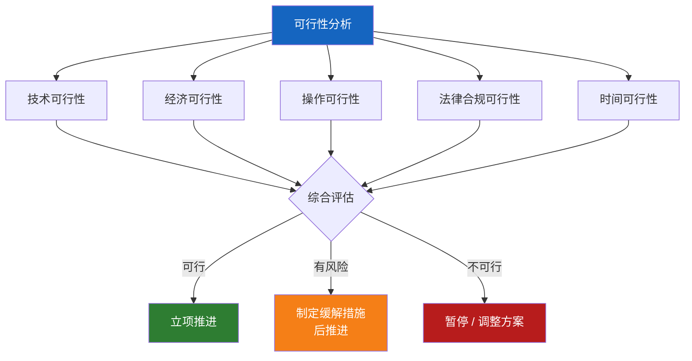
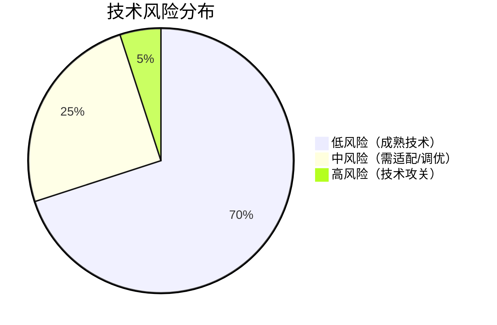
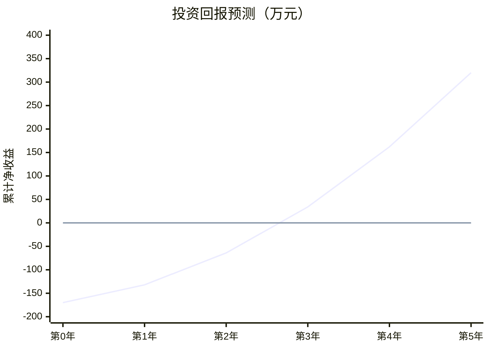
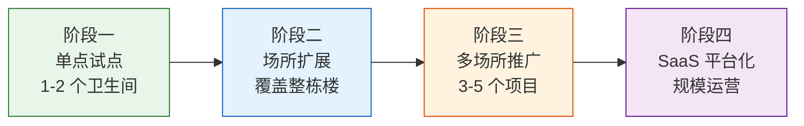

# 02 — 可行性分析

> 文档版本：v0.1.0 | 创建日期：2026-03-05 | 状态：草案

---

## 1. 可行性分析框架



---

## 2. 技术可行性

### 2.1 IoT 硬件层

| 技术点 | 成熟度 | 可选方案 | 风险评估 | 结论 |
|--------|--------|---------|---------|------|
| 人流量计数 | 成熟 | 红外对射、TOF 深度相机、毫米波雷达 | 低 — 已有大量商业产品 | **可行** |
| 空气质量传感 | 成熟 | NH₃/H₂S 电化学传感器（如 SGP41） | 低 — 精度满足需求 | **可行** |
| 耗材余量检测 | 较成熟 | 重力传感器 / 红外测距 | 中 — 需适配不同厂家的纸巾机/皂液器 | **可行，需定制适配** |
| 水浸/漏水检测 | 成熟 | 水浸传感器 | 低 | **可行** |
| 设备通信 | 成熟 | LoRa / NB-IoT / Wi-Fi | 低 — 视场所网络覆盖情况选择 | **可行** |
| 边缘网关 | 成熟 | 树莓派 / 工业网关 | 低 | **可行** |

### 2.2 软件平台层

| 技术点 | 成熟度 | 可选方案 | 风险评估 | 结论 |
|--------|--------|---------|---------|------|
| IoT 数据接入 | 成熟 | MQTT + EMQX / 阿里云 IoT | 低 | **可行** |
| 微服务架构 | 成熟 | Spring Cloud / Go 微服务 | 低 | **可行** |
| 移动端 APP | 成熟 | Flutter / React Native / 原生 | 低 | **可行** |
| 实时推送 | 成熟 | WebSocket / 极光推送 | 低 | **可行** |
| AI 图像质检 | 较成熟 | YOLO / 自训练模型 | 中 — 需要收集训练数据集 | **可行，需投入标注成本** |
| 智能排班算法 | 较成熟 | 运筹优化 / 启发式算法 | 中 — 需要迭代调优 | **可行** |
| 数据可视化 | 成熟 | ECharts / Grafana | 低 | **可行** |

### 2.3 技术可行性结论



**结论**：核心技术栈均已成熟，中等风险项可通过 PoC 验证和迭代优化解决。**技术可行性 — 通过**。

---

## 3. 经济可行性

### 3.1 投入成本估算

| 成本项 | 一次性投入（万元） | 年运营（万元） | 说明 |
|--------|------------------|---------------|------|
| 硬件设备 | 30-50 | 5-8 | 传感器 + 网关，按 50 间卫生间估算 |
| 软件开发 | 80-120 | — | 6-8 人团队，8-10 个月 |
| 云服务 / 运维 | 5 | 15-25 | 服务器、CDN、监控 |
| AI 模型训练 | 10-15 | 3-5 | 数据标注 + 算力 |
| 实施部署 | 10-15 | — | 现场安装调试、培训 |
| **合计** | **135-205** | **23-38** | — |

### 3.2 收益分析

| 收益项 | 预估年节省 / 创收（万元） | 说明 |
|--------|-------------------------|------|
| 人力成本优化 | 20-40 | 智能调度减少冗余人力 15%-25% |
| 耗材浪费减少 | 5-10 | 精准补给避免过度备货 |
| 投诉率下降 | 间接 | 提升品牌形象，减少罚款 |
| 设备预防维护 | 3-5 | 减少紧急维修成本 |
| SaaS 订阅收入 | 50-100 | 面向多个物业公司推广 |
| **合计** | **78-155** | — |

### 3.3 投资回报分析



- **投资回收期**：约 2.5-3 年
- **5 年 ROI**：约 188%

**结论**：项目经济效益可观，中长期回报明确。**经济可行性 — 通过**。

---

## 4. 操作可行性

### 4.1 组织准备度

| 评估维度 | 现状 | 改进措施 | 可行性 |
|---------|------|---------|--------|
| 管理层支持 | 物业行业数字化转型意愿强 | 高层汇报 + 试点效果展示 | 高 |
| 一线人员接受度 | 保洁人员年龄偏大，智能手机使用能力参差 | 极简 UI 设计 + 大字体 + 语音提示 + 现场培训 | 中 |
| IT 能力 | 物业公司通常无专职 IT | SaaS 模式免运维 + 7×24 客服 | 高 |
| 变革阻力 | 部分人员可能抗拒考核数据化 | 渐进推行 + 正向激励机制 | 中 |

### 4.2 实施策略



**结论**：通过极简设计和渐进式推广策略可有效降低操作风险。**操作可行性 — 通过**。

---

## 5. 法律合规可行性

| 法规 / 标准 | 相关要求 | 系统应对策略 | 合规性 |
|------------|---------|-------------|--------|
| 《个人信息保护法》 | 不得过度收集个人信息 | 公众端匿名使用，不采集身份信息；员工端仅采集工作相关数据 | 合规 |
| 《数据安全法》 | 数据分类分级保护 | 建立数据分类体系，敏感数据加密存储 | 合规 |
| 《城市公厕管理办法》 | 清洁频次、设施标准 | 系统配置满足最低清洁频次要求 | 合规 |
| GB/T 33170-2016《城市公共厕所服务质量要求》 | 服务质量指标 | 质检模块对标国标指标 | 合规 |
| 无障碍设施要求 | 残障人士可达性 | APP 支持无障碍模式 | 合规 |
| 劳动法 | 工时、隐私 | 不采用人脸识别考勤；工时统计透明 | 合规 |

**结论**：系统设计从一开始遵循隐私最小化原则，不涉及人脸识别等高风险技术。**法律合规可行性 — 通过**。

---

## 6. 时间可行性

| 阶段 | 预估工期 | 关键前提 |
|------|---------|---------|
| 需求与设计 | 6-8 周 | 甲方及时确认需求 |
| PoC 验证（IoT + 核心链路） | 4 周 | 硬件到货 |
| MVP 开发（Sprint 1-4） | 12-16 周 | 团队到位 |
| 试点部署 + 迭代 | 4-6 周 | 试点场地准备就绪 |
| 正式上线 | 2 周 | UAT 通过 |
| **合计** | **28-36 周** | — |

**结论**：7-9 个月的开发周期在行业内属合理范围。**时间可行性 — 通过**。

---

## 7. 风险登记册

| ID | 风险描述 | 概率 | 影响 | 等级 | 缓解措施 |
|----|---------|------|------|------|---------|
| R01 | IoT 设备在潮湿环境下故障率高 | 中 | 高 | 高 | 选择 IP67 防护等级设备；设置冗余传感器 |
| R02 | 一线保洁人员抵触使用 APP | 中 | 中 | 中 | 极简化设计 + 正向激励 + 持续培训 |
| R03 | AI 质检模型准确率不达标 | 中 | 中 | 中 | 分阶段上线，初期人工 + AI 辅助 |
| R04 | 甲方需求频繁变更 | 高 | 中 | 高 | 敏捷迭代 + 需求基线管控 + 变更流程 |
| R05 | 网络环境差（地铁/地下） | 中 | 高 | 高 | 离线优先架构 + 断点续传 |
| R06 | 数据安全泄露 | 低 | 高 | 中 | 端到端加密 + 安全审计 + 渗透测试 |

---

## 8. 综合可行性评估

```mermaid
radar
    title 可行性综合评估
    axis 技术可行性, 经济可行性, 操作可行性, 法律合规, 时间可行性
    curve "PRISM" [0.85, 0.75, 0.70, 0.90, 0.80]
    options {"legend": false}
```

| 维度 | 评分 | 结论 |
|------|------|------|
| 技术可行性 | 85/100 | 核心技术成熟，少量需 PoC 验证 |
| 经济可行性 | 75/100 | ROI 可观，但前期投入较大 |
| 操作可行性 | 70/100 | 需重视一线人员培训和变革管理 |
| 法律合规 | 90/100 | 隐私最小化原则，合规风险低 |
| 时间可行性 | 80/100 | 工期合理，需控制需求蔓延 |
| **综合** | **80/100** | **项目可行，建议立项推进** |

---

> 上一篇：[01-需求分析](01-需求分析.md) | 下一篇：[03-功能梳理](03-功能梳理.md)
