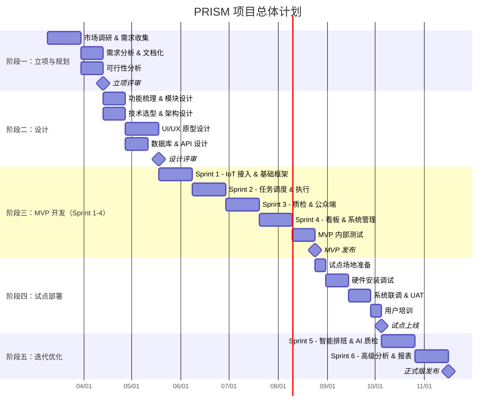
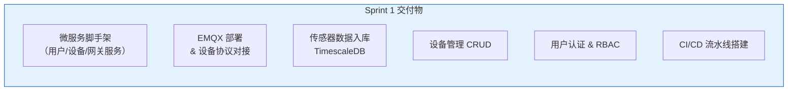
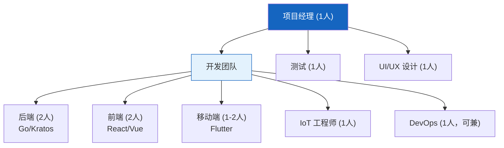
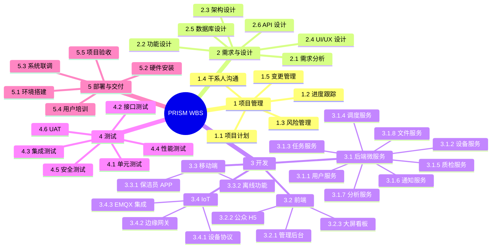
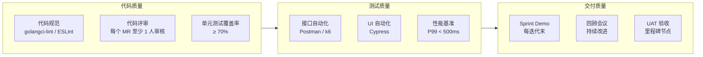

# 05 — 项目规划与里程碑

> 文档版本：v0.1.0 | 创建日期：2026-03-05 | 状态：草案

---

## 1. 总体项目计划

---

## 2. 里程碑定义

| 里程碑 | 名称 | 预计日期 | 交付物 | 验收标准 |
|--------|------|---------|--------|---------|
| M1 | 立项评审通过 | 2026-05-01 | 需求文档、可行性报告 | 评审委员会签字 |
| M2 | 设计评审通过 | 2026-06-12 | 架构设计、原型、API 文档 | 技术评审通过 |
| M3 | MVP 发布 | 2026-09-18 | 可运行的 MVP 系统 | 核心功能测试通过 |
| M4 | 试点上线 | 2026-11-06 | 试点场所运行系统 | UAT 通过、用户可操作 |
| M5 | 正式版发布 | 2026-12-25 | 含 AI 质检的完整系统 | 全功能测试 + 性能测试通过 |

---

## 3. 迭代计划详情

### Sprint 1：IoT 接入 & 基础框架（3 周）

| 任务 | 负责人 | 工时（人天） |
|------|--------|------------|
| Go 微服务项目初始化（Kratos） | 后端 Lead | 3 |
| 用户服务（注册/登录/权限） | 后端 A | 5 |
| 设备服务（设备管理 CRUD） | 后端 B | 5 |
| EMQX 部署 + MQTT 协议对接 | IoT 工程师 | 5 |
| 传感器数据采集 & 存储 | 后端 B + IoT | 5 |
| PostgreSQL + TimescaleDB 搭建 | DBA/后端 | 3 |
| React 管理后台脚手架 | 前端 A | 3 |
| CI/CD + K8s 部署模板 | DevOps | 5 |
| 单元测试 & 接口测试 | 全员 | 3 |

### Sprint 2：任务调度 & 清洁执行（3 周）

| 任务 | 负责人 | 工时（人天） |
|------|--------|------------|
| 任务服务（CRUD + 状态机） | 后端 A | 5 |
| 调度服务（规则引擎 + 派单） | 后端 B | 8 |
| 排班管理 | 后端 A | 3 |
| Flutter APP 脚手架 + 登录 | 移动端 A | 5 |
| 任务列表 & 执行流程（APP） | 移动端 A | 5 |
| 扫码签到 & 拍照上传（APP） | 移动端 B | 5 |
| 后台任务管理页面 | 前端 A | 5 |
| 文件服务（MinIO + 图片上传） | 后端 B | 3 |
| 推送通知集成（极光） | 移动端 B | 3 |

### Sprint 3：质检 & 公众端（3 周）

| 任务 | 负责人 | 工时（人天） |
|------|--------|------------|
| 质检服务（审核流程） | 后端 A | 5 |
| 主管质检操作（后台 + APP） | 前端 A + 移动端 | 5 |
| 公众 H5 页面（Vue 3 + Vant） | 前端 B | 5 |
| 扫码评价 & 报修功能 | 前端 B + 后端 | 5 |
| 通知服务（模板 + 多渠道） | 后端 B | 3 |
| 离线模式实现（Flutter） | 移动端 A | 5 |
| 实时状态 WebSocket 推送 | 后端 B | 3 |
| 集成测试 | QA | 5 |

### Sprint 4：看板 & 系统管理（3 周）

| 任务 | 负责人 | 工时（人天） |
|------|--------|------------|
| 分析服务（指标聚合） | 后端 A | 5 |
| 运营数据看板 | 前端 A | 5 |
| 实时大屏看板 | 前端 B | 5 |
| 多租户管理 | 后端 B | 5 |
| 组织架构 & 权限管理 | 后端 A + 前端 | 5 |
| 操作日志审计 | 后端 B | 3 |
| 性能优化 & 压力测试 | 全员 | 5 |
| Bug 修复 & 回归测试 | 全员 + QA | 5 |

---

## 4. 团队配置

| 角色 | 人数 | 职责 |
|------|------|------|
| 项目经理 | 1 | 进度管理、风险管控、干系人沟通 |
| 后端开发 | 2 | 微服务开发、API、数据库 |
| 前端开发 | 2 | 管理后台、H5、大屏 |
| 移动端开发 | 1-2 | Flutter APP |
| IoT 工程师 | 1 | 硬件对接、EMQX、边缘网关 |
| UI/UX 设计 | 1 | 原型、UI 设计、交互体验 |
| QA 测试 | 1 | 功能/接口/性能测试 |
| DevOps | 1（可兼任） | CI/CD、监控、运维 |
| **总计** | **8-10 人** | — |

---

## 5. 工作分解结构（WBS）

---

## 6. 风险管理计划

| 风险 | 应对策略 | 负责人 | 监控频率 |
|------|---------|--------|---------|
| 需求蔓延 | 需求基线锁定 + 变更控制流程 | PM | 每周 |
| IoT 硬件延迟到货 | 提前采购 + 备用供应商 | IoT 工程师 | 每周 |
| AI 模型精度不达标 | 分阶段上线，先人工后 AI 辅助 | AI/后端 | 每 Sprint |
| 一线用户抵触 | 试点阶段深度参与 + 正向激励 | PM + UX | 试点期间每日 |
| 关键人员离职 | 代码评审确保知识共享 + 文档化 | PM | 每月 |
| 网络环境差 | 离线优先架构 + 充分测试 | 移动端 | 每 Sprint |

---

## 7. 质量管理计划

---

## 8. 沟通计划

| 会议 | 频率 | 参与人 | 目的 |
|------|------|--------|------|
| 每日站会 | 每日 15 分钟 | 开发团队 | 同步进度、暴露阻塞 |
| Sprint 计划会 | 每 3 周初 | 全员 | 规划迭代目标和任务 |
| Sprint 评审 | 每 3 周末 | 全员 + 甲方 | 演示成果、收集反馈 |
| Sprint 回顾 | 每 3 周末 | 开发团队 | 总结改进点 |
| 干系人周报 | 每周 | PM → 甲方/管理层 | 汇报进度和风险 |
| 技术评审 | 按需 | 技术团队 | 关键设计方案评审 |

---

## 9. 项目成功标准

| 维度 | 指标 | 目标值 |
|------|------|--------|
| 进度 | 里程碑达成率 | ≥ 90% 按时交付 |
| 质量 | 生产环境 Bug 率 | ≤ 0.5 个 / 千行代码 |
| 质量 | UAT 一次通过率 | ≥ 85% |
| 性能 | API P99 响应时间 | ≤ 500ms |
| 性能 | 系统可用率 | ≥ 99.9% |
| 满意度 | 甲方满意度 | ≥ 4.0 / 5.0 |
| 满意度 | 终端用户（保洁员）满意度 | ≥ 3.5 / 5.0 |
| 成本 | 预算偏差 | ≤ ±10% |

---

> 上一篇：[04-技术选型](04-技术选型.md) | 首页：[00-项目概述与总体流程](00-项目概述与总体流程.md)
