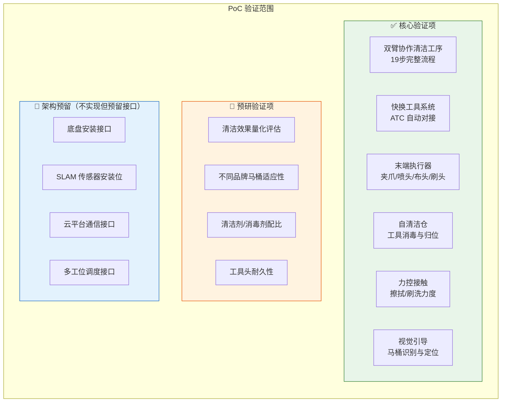
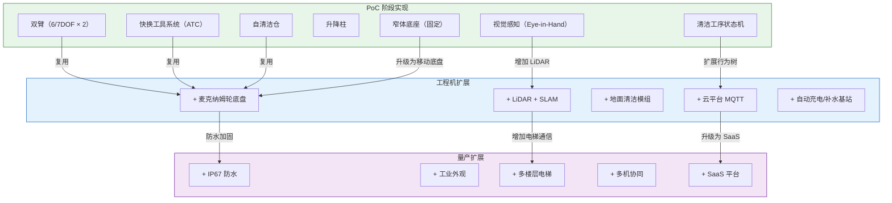

# 11 — PoC 总体规划与目标定义

> 文档版本：v0.1.0 | 创建日期：2026-03-05 | 状态：草案
>
> 本文档定义 PRISM 项目以"**马桶清洁**"为切入点的 PoC（Proof of Concept）原型总体规划。

---

## 1. PoC 战略定位

### 为什么选择马桶清洁作为切入点？

| 维度 | 原因 |
|------|------|
| **技术密度最高** | 马桶清洁涉及精密操作（开盖/刷洗/擦拭）、多工具切换、力控接触，是整个卫生间清洁中最具挑战性的任务 |
| **验证价值最大** | 能完成马桶清洁的机器人，扩展到地面/台面清洁会容易得多（降维） |
| **工序标准化程度高** | 马桶清洁流程相对固定（消毒→擦拭→刷洗→收尾），适合作为首个自动化目标 |
| **市场感知度强** | 马桶清洁是公众对"卫生间脏"感知最强烈的部分，PoC 演示效果直观 |
| **独立闭环** | 可在固定工位完成，不依赖导航系统，降低 PoC 复杂度 |

---

## 2. PoC 目标定义

### 2.1 核心目标

> **在实验室 / 模拟卫生间环境中，实现双臂机器人对标准坐便器的全自动清洁，完成 19 步标准工序，清洁质量达到人工保洁 80% 以上水平。**

### 2.2 量化指标

| 指标 | 目标值 | 说明 |
|------|--------|------|
| 清洁工序完成率 | ≥ 95%（19 步中至少 18 步自动完成） | 允许 1 步降级为半自动 |
| 单次清洁耗时 | ≤ 10 分钟 | 人工保洁约 5-8 分钟 |
| 清洁质量评分 | ≥ 80/100（人工盲评） | 对标人工保洁效果 |
| 快换成功率 | ≥ 95% | 含 ABC 三种工具头 |
| 连续作业 | ≥ 5 次不间断 | 验证自清洁仓有效性 |
| 安全零事故 | 0 次碰撞/损坏 | 力矩保护 + 急停 |

### 2.3 非目标（PoC 阶段明确排除）

| 排除项 | 原因 | 何时引入 |
|--------|------|---------|
| ~~自主导航~~ | PoC 聚焦清洁能力验证 | 工程机阶段 |
| ~~地面/台面/镜面清洁~~ | 非核心切入点 | 工程机阶段 |
| ~~云平台对接~~ | PoC 本地运行即可 | 工程机阶段 |
| ~~工业外观设计~~ | PoC 优先功能验证 | 工程机阶段 |
| ~~多马桶连续作业~~ | PoC 单工位验证 | 工程机阶段 |
| ~~防水（IP67）~~ | PoC 实验室环境可控 | 工程机阶段 |

---

## 3. PoC 验证范围

---

## 4. PoC 与完整项目的可扩展映射

**关键设计原则**：PoC 阶段的双臂系统、快换工具、自清洁仓是**核心资产**，后续阶段只做加法（加底盘、加传感器、加平台），不会推翻 PoC 的核心架构。

---

## 5. PoC 成功标准

| 等级 | 条件 | 意味着 |
|------|------|--------|
| **L1 — 基本成功** | 完成 19 步工序中的 15 步以上（≥ 80%），单次耗时 ≤ 15 分钟 | 技术路线可行，值得继续投入 |
| **L2 — 达标成功** | 完成 18 步以上（≥ 95%），单次耗时 ≤ 10 分钟，质量评分 ≥ 80 | 可进入工程机阶段 |
| **L3 — 超预期成功** | 全部 19 步自动完成，耗时 ≤ 8 分钟，质量评分 ≥ 90，适配 ≥ 3 种马桶 | 可直接启动商业化试点 |

---

## 6. 文档索引（PoC 系列）

| 序号 | 文档名称 | 说明 |
|------|---------|------|
| 11 | PoC 总体规划与目标定义（本文档） | 战略定位、目标、验证范围、可扩展性 |
| 12 | [PoC 功能定义与清洁工序](12-PoC功能定义与清洁工序.md) | 19 步工序详解、双臂协作时序、状态机 |
| 13 | [PoC 硬件形态与结构设计](13-PoC硬件形态与结构设计.md) | 双臂/底座/快换/自清洁仓的结构方案 |
| 14 | [PoC 软件架构与技术方案](14-PoC软件架构与技术方案.md) | ROS 2 节点/视觉/力控/状态机 |
| 15 | [PoC 开发规划与团队配置](15-PoC开发规划与团队配置.md) | 甘特图、人员、预算、风险 |

---

> 返回：[首页](../index.md) | 下一篇：[12-PoC 功能定义与清洁工序](12-PoC功能定义与清洁工序.md)
