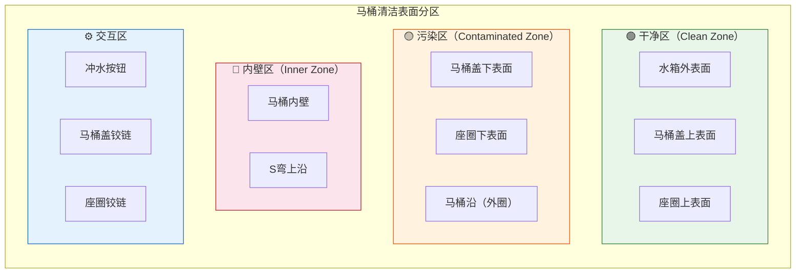
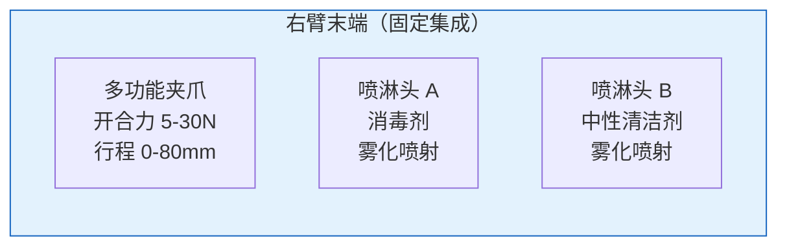
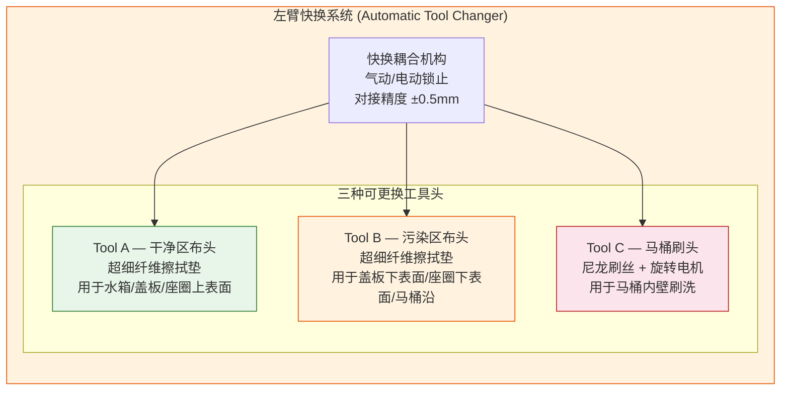
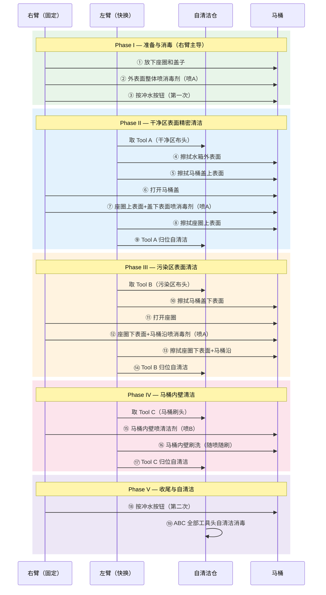
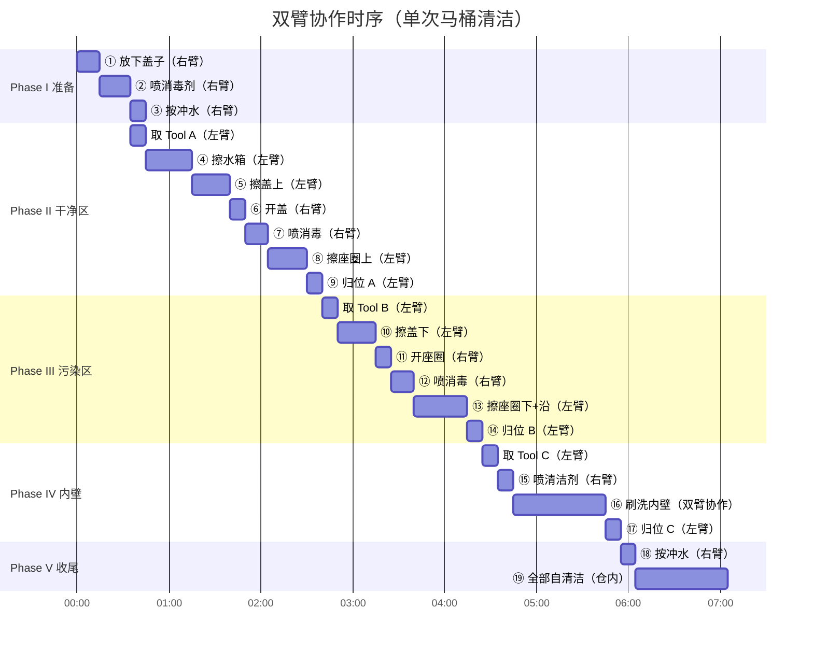
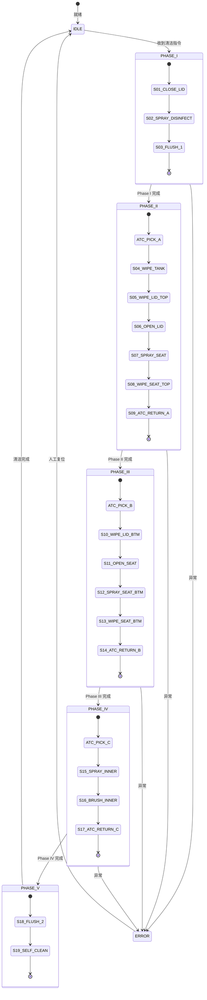

# 12 — PoC 功能定义与清洁工序

> 文档版本：v0.1.0 | 创建日期：2026-03-05 | 状态：草案
>
> 本文档详细定义 PoC 阶段的马桶清洁功能和 19 步标准工序。

---

## 1. 清洁对象定义

### 1.1 目标马桶类型

| 参数 | PoC 首选 | 扩展目标 |
|------|---------|---------|
| 类型 | 连体式坐便器 | 分体式、壁挂式 |
| 冲水方式 | 按钮式 | 扳手式、感应式 |
| 尺寸范围 | 长 650-750mm × 宽 350-400mm × 高 380-420mm | 后续适配更多尺寸 |
| 品牌参考 | TOTO / 科勒 / 箭牌（主流型号） | 覆盖市场 Top 10 品牌 |
| 材质 | 陶瓷 | — |
| 有无水箱 | 有外露水箱 | 隐藏水箱型 |

### 1.2 清洁表面分区

**防交叉污染核心原则**：干净区 → 污染区 → 内壁区，严格按污染程度递进，**不同分区使用不同工具头**。

---

## 2. 末端执行器与工具定义

### 2.1 右臂 — 固定配置

| 组件 | 规格 | 功能 |
|------|------|------|
| 多功能夹爪 | 平行双指，自适应指尖，力传感器 | 按冲水按钮、开关马桶盖/座圈 |
| 喷淋头 A | 雾化喷嘴，流量可调 0-50 mL/s | 喷洒消毒剂（次氯酸/季铵盐类） |
| 喷淋头 B | 雾化喷嘴，流量可调 0-50 mL/s | 喷洒中性清洁剂 |

### 2.2 左臂 — 快换系统（ATC）

| 工具 | 标识色 | 目标表面 | 工作方式 | 防污染逻辑 |
|------|--------|---------|---------|-----------|
| Tool A 布头 | 绿色 | 干净区（水箱/盖上/圈上） | 接触式擦拭，力控 2-5N | 仅接触干净表面，最先使用 |
| Tool B 布头 | 黄色 | 污染区（盖下/圈下/马桶沿） | 接触式擦拭，力控 3-8N | 接触潜在污染表面，A 之后使用 |
| Tool C 刷头 | 红色 | 内壁区（马桶内壁） | 旋转刷洗 200-400 RPM | 最后使用，最高污染级别 |

---

## 3. 标准清洁工序（19 步）

### 3.1 工序总览时序图

### 3.2 工序详细定义

| 工序 | 内容 | 执行臂 / 工具 | 操作对象 | 技术要点 | 防污染逻辑 |
|:----:|------|---------------|---------|---------|-----------|
| **Phase I — 准备与消毒** | | | | | |
| ① | 放下座圈和盖子（若开启） | 右臂 → 夹爪 | 座圈 + 盖子 | 力控合页操作；检测当前状态 | 交互动作 |
| ② | 外表面整体喷消毒剂 | 右臂 → 喷 A | 马桶整体外表面 | 均匀覆盖喷洒；预设轨迹 | 整体消毒，降低后续风险 |
| ③ | 按冲水按钮（第一次） | 右臂 → 夹爪 | 冲水按钮 | 力控按压 10-20N；识别按钮位置 | 冲去旧污 |
| **Phase II — 干净区清洁** | | | | | |
| ④ | 擦拭水箱外表面 | 左臂 → **Tool A** | 水箱 | 接触力 2-5N；覆盖式轨迹 | 干净区 A 布 |
| ⑤ | 擦拭马桶盖上表面 | 左臂 → Tool A | 盖上表面 | 接触力 2-5N；平面跟踪 | 干净区 A 布 |
| ⑥ | 打开马桶盖 | 右臂 → 夹爪 | 马桶盖 | 力控铰链操作；角度检测 | 交互动作 |
| ⑦ | 座圈上+盖下喷消毒剂 | 右臂 → 喷 A | 座圈上 + 盖下 | 分区喷洒 | 为后续擦拭消毒 |
| ⑧ | 擦拭座圈上表面 | 左臂 → Tool A | 座圈上表面 | 环形轨迹；力控 3-5N | A 布最后一步使用 |
| ⑨ | Tool A 归位自清洁 | 左臂 → ATC | 自清洁仓 | 对接精度 ±0.5mm | A 布消毒处理 |
| **Phase III — 污染区清洁** | | | | | |
| ⑩ | 擦拭马桶盖下表面 | 左臂 → **Tool B** | 盖下表面 | 力控 3-8N；曲面跟踪 | 污染区 B 布 |
| ⑪ | 打开座圈 | 右臂 → 夹爪 | 座圈 | 力控铰链操作 | 交互动作 |
| ⑫ | 座圈下+马桶沿喷消毒剂 | 右臂 → 喷 A | 座圈下 + 马桶沿 | 分区喷洒 | 为后续擦拭消毒 |
| ⑬ | 擦拭座圈下+马桶沿 | 左臂 → Tool B | 座圈下 + 马桶沿 | 复杂曲面跟踪；力控 5-8N | B 布最后一步使用 |
| ⑭ | Tool B 归位自清洁 | 左臂 → ATC | 自清洁仓 | 对接精度 ±0.5mm | B 布消毒处理 |
| **Phase IV — 内壁清洁** | | | | | |
| ⑮ | 马桶内壁喷清洁剂 | 右臂 → 喷 B | 内壁 | 环形喷洒覆盖 | 清洁剂辅助 |
| ⑯ | 马桶内壁刷洗（随喷随刷） | 左臂 → **Tool C** + 右臂 → 喷 B | 内壁 | 双臂协作；刷头旋转 200-400RPM；力控 5-15N | 最高污染级别 |
| ⑰ | Tool C 归位自清洁 | 左臂 → ATC | 自清洁仓 | 对接精度 ±0.5mm | C 刷消毒处理 |
| **Phase V — 收尾** | | | | | |
| ⑱ | 按冲水按钮（第二次） | 右臂 → 夹爪 | 冲水按钮 | 同 ③ | 冲去清洁剂和残留 |
| ⑲ | 所有工具头自清洁 | 自清洁仓 | ABC 全部 | 蒸汽/超声波/UV 消毒 | 全部工具复位为洁净状态 |

---

## 4. 双臂协作时序

**预估总耗时**：约 **7-9 分钟**（不含等待自清洁仓完成的时间，自清洁与下次任务并行）。

---

## 5. 清洁工序状态机

---

## 6. 视觉感知需求（PoC 阶段）

| 感知任务 | 用途 | 方案 | 精度要求 |
|---------|------|------|---------|
| 马桶整体定位 | 确定马桶基准坐标系 | RGB-D + 3D 模型匹配 | 位置 ±5mm，姿态 ±2° |
| 马桶盖/座圈状态识别 | 判断开/关/半开 | RGB 图像分类 | 准确率 ≥ 95% |
| 冲水按钮定位 | 引导夹爪按压 | RGB-D + 模板匹配 | ±3mm |
| 清洁表面法线估计 | 擦拭/刷洗时力控方向 | 深度图法线计算 | ±5° |
| 工具库位姿检测 | ATC 对接引导 | ArUco 标记 + 深度相机 | ±0.5mm |
| 清洁效果评估 | 清洁前后对比 | RGB 图像差异检测 | 定性评估 |

---

## 7. 力控需求

| 场景 | 接触力范围 | 控制策略 | 安全阈值 |
|------|-----------|---------|---------|
| 擦拭水箱/盖板（平面） | 2-5 N | 阻抗控制，法线方向恒力 | > 10 N 退缩 |
| 擦拭座圈（曲面） | 3-8 N | 阻抗控制 + 曲面法线跟踪 | > 15 N 退缩 |
| 刷洗内壁 | 5-15 N | 阻抗控制 + 旋转力矩限制 | > 25 N 急停 |
| 按冲水按钮 | 10-20 N | 位置-力混合控制 | > 30 N 急停 |
| 开关盖子/座圈 | 3-10 N | 柔顺控制，跟随铰链运动 | > 20 N 急停 |
| ATC 对接 | 5-15 N | 引导对接，卡锁确认 | > 25 N 急停 |

---

> 上一篇：[11-PoC 总体规划](11-PoC总体规划与目标定义.md) | 下一篇：[13-PoC 硬件形态](13-PoC硬件形态与结构设计.md)
