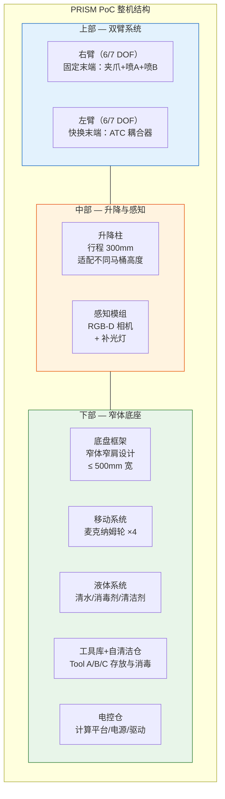
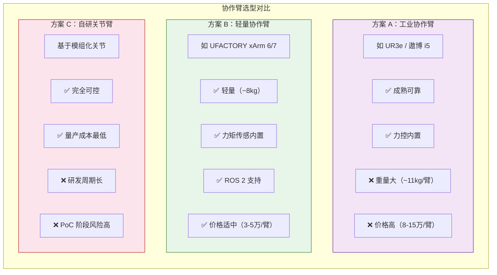
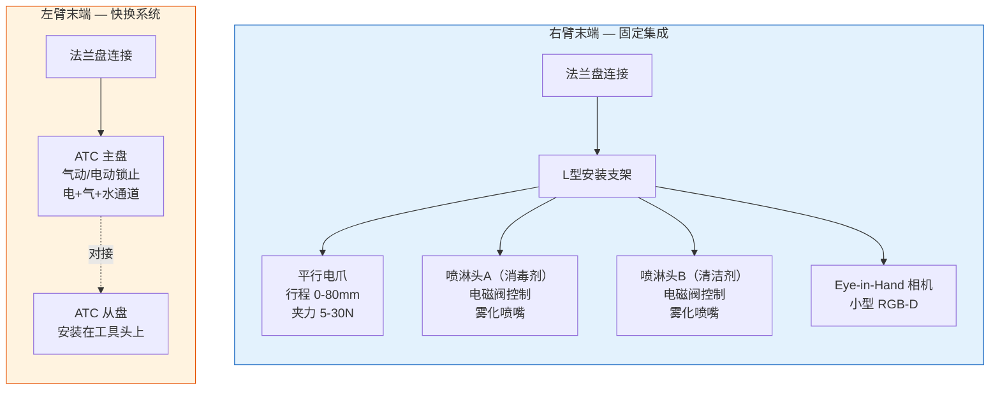
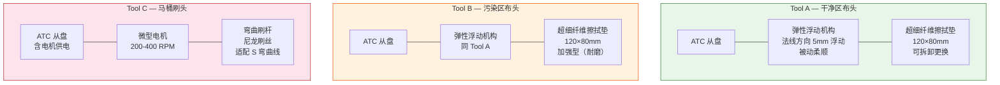
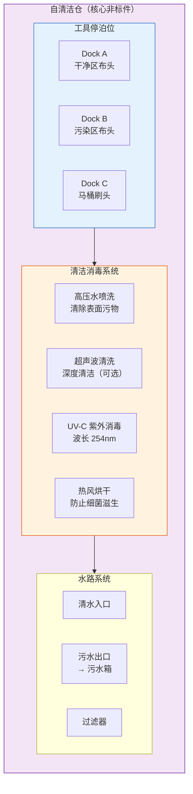
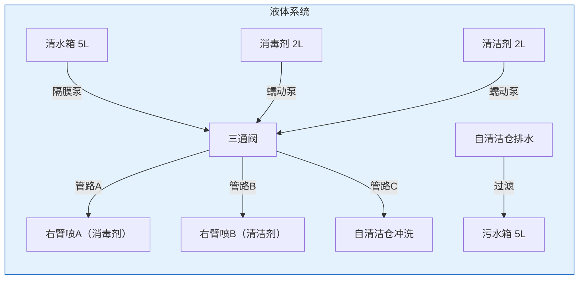
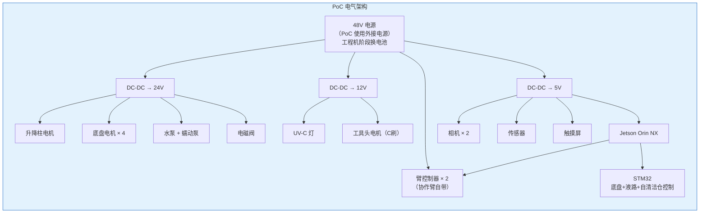

# 13 — PoC 硬件形态与结构设计

> 文档版本：v0.1.0 | 创建日期：2026-03-05 | 状态：草案
>
> 本文档定义 PoC 原型机的硬件形态、结构布局和关键组件设计。

---

## 1. 整机形态概览



---

## 2. 整机尺寸与约束

```
                 ┌─ RGB-D 相机
                 │  ┌─ 右臂
            ┌────┤  │    ┌─ 左臂
            │    │  │    │
            ▼    ▼  ▼    ▼
        ╔═══════════════════════╗  ← 最大高度 ~1400mm（臂展开）
        ║   双臂工作区域        ║     收纳高度 ~1100mm
        ╠═══════════════════════╣  ← 升降柱顶部 ~1000mm
        ║  升降柱 + 感知模组    ║
        ╠═══════════════════════╣  ← 底座顶部 ~600mm
        ║  液体箱 │ 自清洁仓    ║
        ║─────────┤             ║
        ║  电控仓 │ 工具库      ║
        ╠═══════════════════════╣
        ║  ○  麦克纳姆轮  ○    ║  ← 离地 ~80mm
        ╚═══════════════════════╝
         ←───── 500mm ─────→
         深度约 600mm
```

| 参数 | PoC 目标值 | 说明 |
|------|-----------|------|
| 宽度 | ≤ 500mm | 窄肩设计，未来适配 600mm 门宽 |
| 深度 | ≤ 600mm | 含液体箱 |
| 高度（收纳） | ≤ 1100mm | 升降柱收缩、双臂折叠 |
| 高度（工作） | ≤ 1400mm | 升降柱伸展、臂展开 |
| 总重量 | ≤ 70kg（含液体满载） | 包含双臂 + 底座 + 液体 |
| 液体容量 | 清水 5L + 消毒剂 2L + 清洁剂 2L | PoC 阶段够清洁 5+ 次 |

---

## 3. 双臂系统设计

### 3.1 机械臂选型



**PoC 选型决策**：**方案 B — UFACTORY xArm 系列**（或同级国产轻量协作臂）

| 决策依据 | 说明 |
|---------|------|
| PoC 优先 | 成品臂大幅缩短研发周期，专注清洁功能验证 |
| 性价比 | 两臂 ~6-10 万元，PoC 预算可承受 |
| 技术适配 | 内置力矩传感、ROS 2 SDK、碰撞检测 |
| 可扩展 | 量产阶段可平滑过渡到自研关节方案 |

### 3.2 臂端配置



---

## 4. 快换工具系统（ATC）设计

### 4.1 ATC 耦合机构

| 参数 | 规格 | 说明 |
|------|------|------|
| 类型 | 气动锁止式 / 电动卡扣式 | PoC 可选电动卡扣降低气路复杂度 |
| 对接精度 | ±0.5mm 径向 / ±1° 角度 | 配合引导锥面 |
| 锁止力 | ≥ 50N | 防止作业中脱落 |
| 通道 | 电信号 × 4 + 气路 × 1（可选）+ 水路 × 1 | 支持工具电机供电 + 水路 |
| 对接时间 | ≤ 3 秒 | 含对准 + 锁止 + 确认 |
| 引导方式 | 视觉引导（ArUco 标记）+ 机械引导锥 | 粗定位 → 精定位 |

### 4.2 三种工具头



---

## 5. 自清洁仓设计



| 参数 | 规格 |
|------|------|
| 停泊位数量 | 3 个（A/B/C 各 1） |
| 清洗方式 | 高压水冲洗 + UV-C 消毒 |
| 清洗周期 | 30-60 秒（与下次任务并行） |
| UV-C 功率 | ≥ 5W（254nm） |
| 仓体材质 | 304 不锈钢（耐腐蚀、易清洁） |
| 密封 | 防溅设计，防止清洗液外溢 |
| 污水处理 | 过滤后排入污水箱 |

---

## 6. 底座系统

### 6.1 移动系统

| 参数 | PoC 规格 | 说明 |
|------|---------|------|
| 驱动方式 | 麦克纳姆轮 × 4 | 全向移动，适应狭窄空间横移 |
| 轮径 | Φ100mm | 平衡通过性与底座高度 |
| 电机 | 直流无刷 × 4，50W/个 | 带编码器 |
| 最大速度 | 0.5 m/s | PoC 低速为主 |
| PoC 用途 | 手动推入或遥控到位 | **PoC 不要求自主导航** |
| 扩展预留 | LiDAR 安装法兰 + 超声波安装位 | 为工程机阶段预留 |

### 6.2 升降柱

| 参数 | 规格 |
|------|------|
| 类型 | 电动直线升降柱 |
| 行程 | 300mm |
| 负载 | ≥ 30kg（支撑双臂） |
| 速度 | 20mm/s |
| 用途 | 适配不同高度马桶；调整臂的工作平面 |

### 6.3 液体系统



---

## 7. 传感器布局（PoC 阶段）


| 传感器 | 数量 | 位置 | 用途 |
|--------|------|------|------|
| Intel RealSense D435i | 1 | 升降柱顶部 | 全局马桶定位、盖/圈状态识别 |
| 小型 RGB 相机 | 1 | 右臂末端 | 按钮/盖子精确定位 |
| 关节力矩传感器 | 内置 | 各臂关节 | 力控、碰撞检测 |
| 接近/位置传感器 | 3 | 工具库各 Dock | ATC 对接引导确认 |
| ArUco 标记 | 6+ | 工具头/Dock/马桶 | 视觉定位参考 |
| 液位传感器 | 4 | 各液体箱 | 余量监测 |

---

## 8. 电气架构



**PoC 阶段使用外接 48V 电源**（非电池），降低复杂度和安全风险。电池方案留待工程机阶段。

---

## 9. 可扩展性设计预留

| 预留项 | 预留方式 | 目标阶段 |
|--------|---------|---------|
| 移动底盘 LiDAR | 底座顶部保留法兰安装位 | 工程机 |
| 超声波避障 | 底座四周预留安装孔 | 工程机 |
| 电池仓 | 底座底部预留电池托架接口 | 工程机 |
| 地面清洁模组 | 底座前方预留安装空间 | 工程机 |
| 自动充电/补水对接口 | 底座侧面预留磁吸接口位 | 工程机 |
| 云平台通信 | 主控预装 Wi-Fi + 4G 模块 | 工程机 |
| 额外工具头 | 工具库预留第 4 个 Dock 位 | 迭代 |

---

> 上一篇：[12-PoC 功能定义与清洁工序](12-PoC功能定义与清洁工序.md) | 下一篇：[14-PoC 软件架构与技术方案](14-PoC软件架构与技术方案.md)
