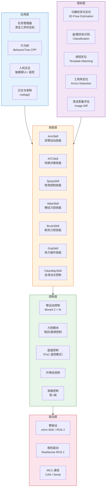
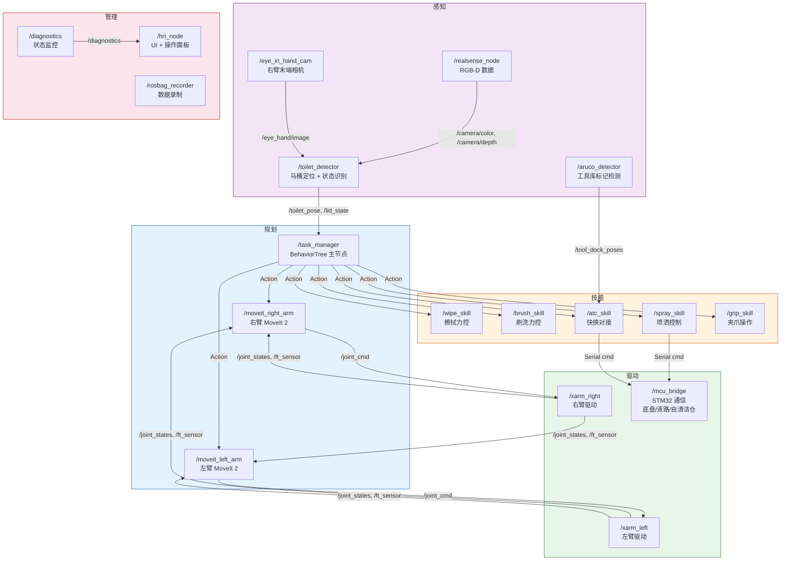
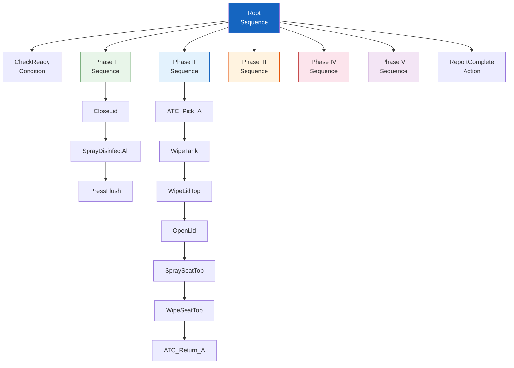
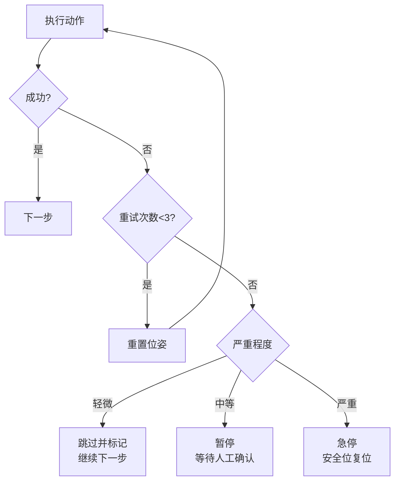
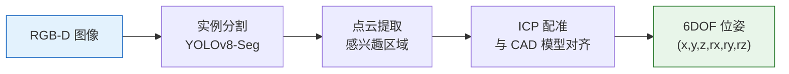
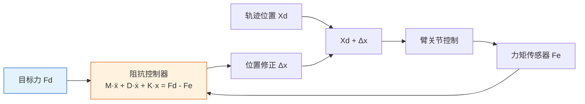
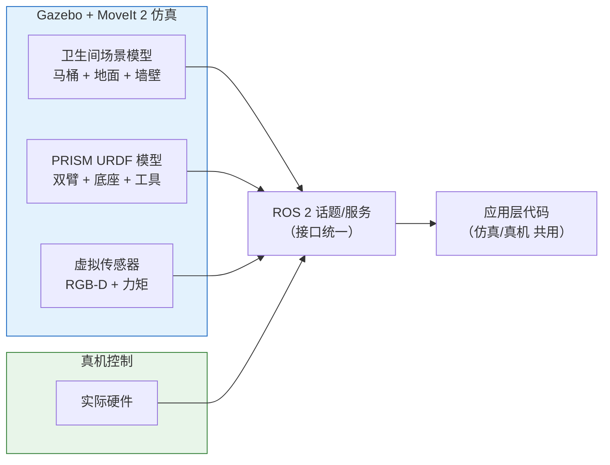

# 14 — PoC 软件架构与技术方案

> 文档版本：v0.1.0 | 创建日期：2026-03-05 | 状态：草案
>
> 本文档定义 PoC 原型机的软件架构、核心算法方案和技术栈选型。

---

## 1. 软件架构总览

---

## 2. ROS 2 节点拓扑（PoC）

---

## 3. 行为树设计

### 3.1 顶层行为树

### 3.2 错误恢复策略

**错误分级**：

| 等级 | 示例 | 处理方式 |
|------|------|---------|
| 轻微 | 擦拭覆盖率不足 | 重试 1-2 次，仍失败则跳过并标记 |
| 中等 | ATC 对接失败 | 暂停，等待人工检查后继续 |
| 严重 | 碰撞/力矩超限/通信中断 | 急停，双臂回安全位，等待人工复位 |

---

## 4. 视觉算法方案

### 4.1 马桶定位

| 步骤 | 算法 | 说明 |
|------|------|------|
| 检测 | YOLOv8-Seg | 马桶实例分割，提取 Mask |
| 点云 | RealSense D435i | 深度图 → 有组织点云 → Mask 裁剪 |
| 配准 | ICP / Super4PCS | 与预建 CAD 模型对齐，输出 6DOF Pose |
| 细化 | ArUco 标记（辅助） | 马桶旁放置标记板辅助初始化（PoC） |

### 4.2 盖/圈状态识别

| 方案 | 说明 |
|------|------|
| 方法 | 图像分类 — ResNet-18 / MobileNet |
| 类别 | 全关（盖+圈）、盖开圈关、全开 |
| 训练数据 | 实拍 500+ 张 + 数据增强 |
| 推理 | TensorRT FP16，Jetson 上 < 10ms |

### 4.3 力控曲面跟踪

**关键参数（PoC 初始值，需现场调参）**：

| 参数 | 擦拭模式 | 刷洗模式 | 说明 |
|------|---------|---------|------|
| 目标力 Fd | 3 N | 10 N | 法线方向 |
| 惯性 M | 5 kg | 10 kg | 虚拟惯性 |
| 阻尼 D | 100 Ns/m | 200 Ns/m | 虚拟阻尼 |
| 刚度 K | 500 N/m | 300 N/m | 虚拟刚度 |
| 控制频率 | 500 Hz | 500 Hz | 臂控制器内环 |

---

## 5. 技术栈汇总

| 层级 | 选型 | 版本 | 说明 |
|------|------|------|------|
| OS | Ubuntu 22.04 + PREEMPT-RT | LTS | Jetson Orin NX |
| 中间件 | ROS 2 Humble | LTS | 通信框架 |
| 臂规划 | MoveIt 2 | latest | 运动规划 + IK |
| 行为规划 | BehaviorTree.CPP v4 | 4.x | 任务编排 |
| 视觉-检测 | YOLOv8 | 8.x | 马桶分割/分类 |
| 视觉-定位 | Open3D + ICP | latest | 点云配准 |
| 视觉-标记 | OpenCV ArUco | 4.x | ATC 引导定位 |
| 推理加速 | TensorRT | 8.x | FP16/INT8 推理 |
| 力控 | 自研（基于臂 SDK） | — | 阻抗/柔顺控制 |
| 下位机 | FreeRTOS + STM32 HAL | — | 液路/自清洁仓 |
| 仿真 | Gazebo Fortress + MoveIt | — | 离线调试验证 |
| 可视化 | RViz2 + Groot2 | — | 状态/行为树调试 |

---

## 6. 仿真方案

**仿真优先策略**：所有清洁工序先在 Gazebo 中验证轨迹和逻辑，通过后再上真机。减少真机调试风险和耗时。

---

## 7. 数据录制与回放

| 录制内容 | Topic | 用途 |
|---------|-------|------|
| 相机图像 | /camera/color, /camera/depth | 视觉算法优化 |
| 关节状态 | /joint_states | 运动回放 |
| 力矩数据 | /ft_sensor | 力控参数调优 |
| TF 树 | /tf, /tf_static | 坐标系验证 |
| 行为树状态 | /bt_status | 流程问题排查 |
| 诊断信息 | /diagnostics | 异常分析 |

每次清洁作业自动录制 rosbag2，形成**可回溯的数据资产**，为后续 AI 训练和算法优化积累素材。

---

> 上一篇：[13-PoC 硬件形态](13-PoC硬件形态与结构设计.md) | 下一篇：[15-PoC 开发规划](15-PoC开发规划与团队配置.md)
