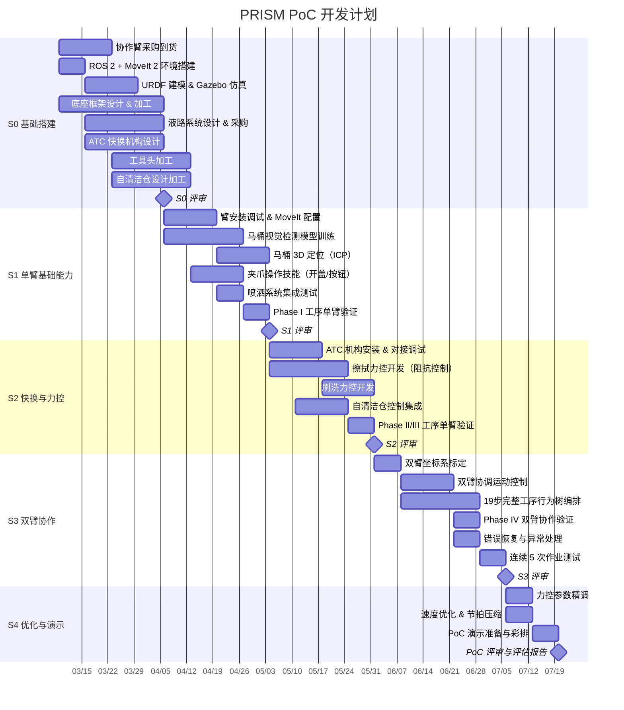
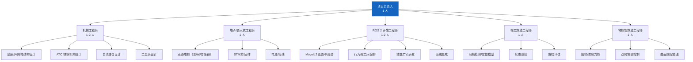
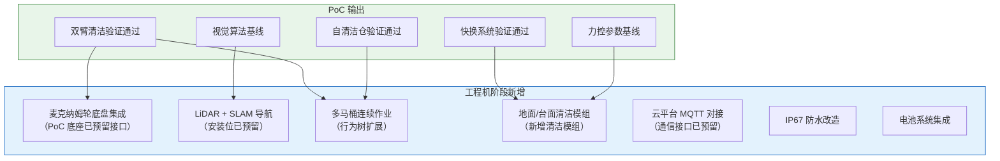

# 15 — PoC 开发规划与团队配置

> 文档版本：v0.1.0 | 创建日期：2026-03-05 | 状态：草案
>
> 本文档规划 PoC 阶段的开发里程碑、人员配置、预算和风险管理。

---

## 1. PoC 开发阶段划分

**总工期：18 周（约 4.5 个月）**

---

## 2. 详细甘特图

---

## 3. 里程碑与 Gate 评审

| 里程碑 | 日期 | 交付物 | Gate 标准 |
|--------|------|--------|----------|
| **MS0** | 2026-04-06 | 仿真环境运行、底座框架完成、ATC 设计完成 | 仿真中双臂可运动；底座可安装臂 |
| **MS1** | 2026-05-04 | 单臂完成 Phase I 工序 | 马桶定位误差 ≤ 10mm；盖/圈操作成功率 ≥ 80% |
| **MS2** | 2026-06-01 | ATC 快换 + 力控擦拭/刷洗单项验证 | ATC 对接成功率 ≥ 90%；力控稳定（无振荡） |
| **MS3** | 2026-07-06 | 19 步完整工序端到端运行 | 完成率 ≥ 80%（≥ 15/19 步）；连续 5 次作业 |
| **MS4** | 2026-07-20 | PoC 评估报告 + 演示 | 达到 L2 成功标准（见 11 号文档） |

---

## 4. 团队配置

### 人员矩阵

| 角色 | 人数 | 全职/兼职 | 关键技能 | 参与阶段 |
|------|------|---------|---------|---------|
| 项目负责人 | 1 | 全职 | 项目管理、机器人系统经验 | 全程 |
| 机械工程师 | 1-2 | 全职 | SolidWorks/Fusion360、非标机构设计 | S0-S2 为主 |
| 电子/嵌入式 | 1 | 全职 | STM32、电路设计、电机驱动 | S0-S2 为主 |
| ROS 2 开发 | 1-2 | 全职 | ROS 2、MoveIt 2、C++/Python | 全程（核心） |
| 视觉算法 | 1 | 全职 | YOLO、点云处理、TensorRT | S1-S3 |
| 臂控制算法 | 1 | 全职 | 力控、MoveIt、运动学 | S1-S4（核心） |
| **合计** | **6-8 人** | — | — | — |

---

## 5. 预算估算

### 5.1 硬件采购

| 物料 | 数量 | 单价(万元) | 小计(万元) | 说明 |
|------|------|-----------|-----------|------|
| 协作臂（如 xArm 6/7） | 2 | 3.5 | 7.0 | 含控制器和力矩传感 |
| Jetson Orin NX 16GB | 1 | 0.4 | 0.4 | 主控 |
| Intel RealSense D435i | 1 | 0.25 | 0.25 | 头部相机 |
| Eye-in-Hand 小相机 | 1 | 0.05 | 0.05 | 右臂末端 |
| 电动夹爪 | 1 | 0.3 | 0.3 | 右臂末端 |
| ATC 快换机构 | 1 套 | 0.8 | 0.8 | 含主盘+3个从盘 |
| 麦克纳姆轮底盘 | 1 | 0.5 | 0.5 | 含电机驱动 |
| 电动升降柱 | 1 | 0.2 | 0.2 | 300mm 行程 |
| 液路系统（泵/阀/管路） | 1 套 | 0.3 | 0.3 | — |
| STM32 开发板 + 驱动板 | 1 套 | 0.05 | 0.05 | — |
| 底座框架加工 | 1 | 0.5 | 0.5 | 铝型材 + CNC 件 |
| 自清洁仓加工 | 1 | 0.8 | 0.8 | 不锈钢 + UV 模块 |
| 工具头加工（A/B/C） | 3 套 | 0.15 | 0.45 | 含备件 |
| 线缆/连接件/紧固件 | — | — | 0.3 | — |
| 测试用马桶 | 2 | 0.15 | 0.3 | 两种型号 |
| **硬件小计** | | | **~12.2** | |

### 5.2 软件与工具

| 项目 | 费用(万元) | 说明 |
|------|-----------|------|
| ROS 2 / MoveIt 2 | 0（开源） | — |
| BehaviorTree.CPP | 0（开源） | — |
| SolidWorks / Fusion 360 | 0.5 | 年许可 |
| GPU 算力（模型训练） | 0.3 | 云 GPU 按需 |
| 杂项工具/耗材 | 0.5 | 清洁剂/布/刷等 |
| **软件小计** | **~1.3** | |

### 5.3 人力成本

| 角色 | 人数 | 月薪(万元) | 月数 | 小计(万元) |
|------|------|-----------|------|-----------|
| 项目负责人 | 1 | 3.0 | 4.5 | 13.5 |
| 机械工程师 | 1.5 | 2.0 | 4.5 | 13.5 |
| 电子/嵌入式 | 1 | 2.0 | 3 | 6.0 |
| ROS 2 开发 | 1.5 | 2.5 | 4.5 | 16.9 |
| 视觉算法 | 1 | 2.5 | 3 | 7.5 |
| 臂控制算法 | 1 | 2.5 | 4 | 10.0 |
| **人力小计** | | | | **~67.4** |

### 5.4 预算总览

| 类别 | 金额(万元) | 占比 |
|------|-----------|------|
| 硬件采购 | 12.2 | 15% |
| 软件工具 | 1.3 | 2% |
| 人力成本 | 67.4 | 83% |
| **合计** | **~81** | 100% |

---

## 6. 风险登记册（PoC 专项）

| ID | 风险 | 概率 | 影响 | 缓解措施 |
|----|------|------|------|---------|
| PR-01 | 协作臂到货延迟 | 中 | 高 | 提前下单；备选型号（遨博/Dobot）；到货前用仿真推进 |
| PR-02 | ATC 快换对接精度不足 | 中 | 高 | 机械引导锥 + 视觉引导双保险；对接后力传感确认 |
| PR-03 | 力控擦拭/刷洗效果差 | 中 | 高 | 预留充分调参时间（S2-S3）；多套力控参数预设 |
| PR-04 | 自清洁仓密封/清洁不彻底 | 中 | 中 | 多轮验证方案；PoC 阶段可降级为人工清洗替代 |
| PR-05 | 马桶视觉定位泛化性差 | 低 | 中 | PoC 阶段固定型号马桶；ArUco 辅助定位兜底 |
| PR-06 | 双臂协调碰撞 | 中 | 高 | MoveIt 碰撞检测；分时操作为主、同时操作谨慎 |
| PR-07 | 19 步工序耗时超标 | 中 | 中 | S4 专项优化；优先保证质量，速度次之 |
| PR-08 | 液路泄漏 | 低 | 中 | 快插接头 + 硅胶管 + 定期检查 |

---

## 7. PoC 交付物清单

| 交付物 | 说明 | 交付时间 |
|--------|------|---------|
| PRISM PoC 原型机 | 可运行的双臂马桶清洁原型 | MS4 |
| 演示视频 | 19 步完整清洁流程录像 | MS4 |
| PoC 评估报告 | 各指标量化评估 + 改进建议 | MS4 |
| 技术文档包 | URDF/CAD 图纸/代码仓库/操作手册 | MS4 |
| 数据集 | 马桶视觉检测训练集 + 力控录制数据 | 全程积累 |
| 工程机阶段计划 | 基于 PoC 结果制定下阶段方案 | MS4 |

---

## 8. PoC → 工程机 过渡计划

**核心原则**：PoC 阶段的每一项输出都是工程机阶段的**直接输入**，不存在推翻重来的环节。

---

## 9. PoC 日常管理

| 会议/活动 | 频率 | 参与人 | 目的 |
|----------|------|--------|------|
| 每日站会 | 每日 15 分钟 | 全员 | 进度同步、暴露阻塞 |
| 周技术评审 | 每周 1 小时 | 全员 | 关键技术难点讨论 |
| 里程碑 Gate 评审 | MS0-MS4 | 全员 + 决策层 | 阶段验收 |
| 代码评审 | 每个 MR | 开发人员 | 质量保证 |
| 每周演示 | 每周 | 全员 | 当周成果可视化 |

---

> 上一篇：[14-PoC 软件架构](14-PoC软件架构与技术方案.md) | 首页：[PoC 总体规划](11-PoC总体规划与目标定义.md)
