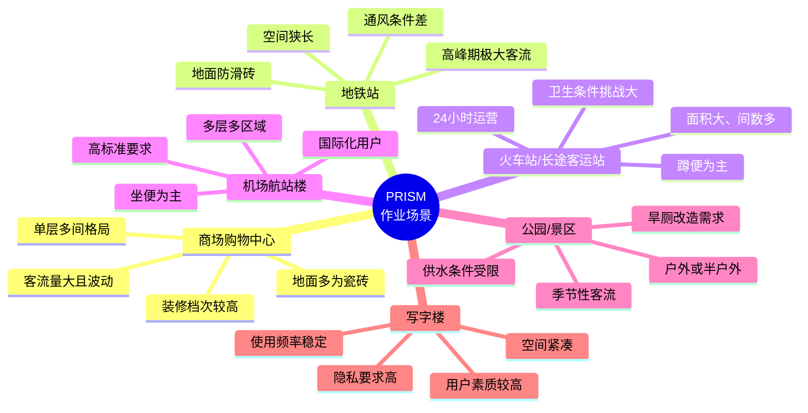
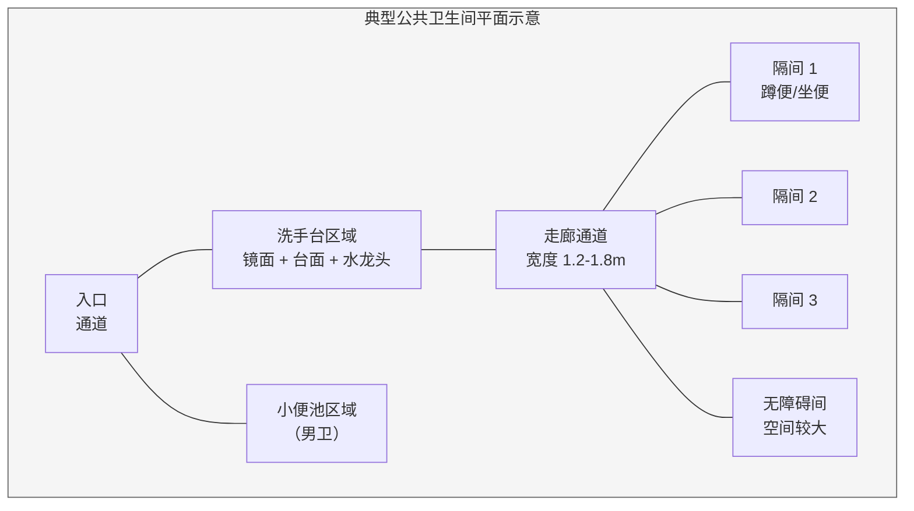
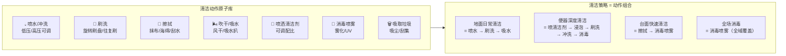
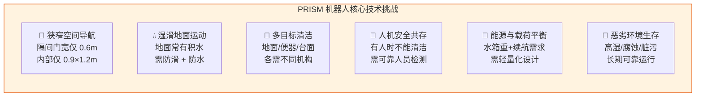
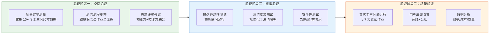

# 06 — 机器人需求分析

> 文档版本：v0.1.0 | 创建日期：2026-03-05 | 状态：草案
>
> 本文档聚焦**机器人本体**的需求分析，平台侧需求详见 [01-需求分析](../platform/01-需求分析.md)

---

## 1. 作业场景分析

### 1.1 目标场景分类

### 1.2 卫生间典型物理布局

### 1.3 场景环境参数

| 环境参数 | 典型值 | 对机器人的影响 |
|---------|--------|--------------|
| **地面材质** | 瓷砖、防滑砖、石材 | 影响轮胎选型、刷盘类型 |
| **地面状态** | 湿滑、有积水、有污渍 | 需防水设计（IP67+）、防滑轮胎 |
| **通道宽度** | 1.2m — 1.8m | 限制机器人最大宽度 ≤ 0.6m |
| **隔间尺寸** | 0.9m × 1.2m（蹲便）/ 0.9m × 1.5m（坐便） | 极其狭窄，需特殊进入策略 |
| **门宽** | 0.6m — 0.7m（普通间）/ 0.9m（无障碍间） | 机器人宽度必须 < 0.55m |
| **门槛/台阶** | 0-5cm 高差 | 需具备越障能力 |
| **温度** | 0°C — 40°C | 北方冬季户外厕所低温挑战 |
| **湿度** | 60% — 100% | 所有电子元件需防潮密封 |
| **光照** | 弱光 — 强光 | 感知方案不能仅依赖视觉 |
| **供水** | 自来水/中水 | 需对接水源，或携带水箱 |
| **供电** | 220V AC | 充电桩供电 |
| **腐蚀性** | 清洁剂、尿液等弱酸碱 | 材料需耐腐蚀 |

---

## 2. 清洁对象分析

### 2.1 清洁目标分解

```mermaid
flowchart TB
    subgraph 清洁对象["清洁对象全景"]
        direction TB
        F["地面"]
        F1["走廊地面 — 大面积冲洗/拖洗"]
        F2["隔间地面 — 狭窄空间刷洗"]
        F3["小便池前地面 — 重点区域"]

        T["洁具"]
        T1["坐便器 — 内壁刷洗 + 外表擦拭 + 坐垫消毒"]
        T2["蹲便器 — 冲洗 + 周边刷洗"]
        T3["小便池 — 内壁冲洗 + 外沿擦拭"]

        W["洗手台"]
        W1["台面 — 擦拭水渍/皂渍"]
        W2["水龙头 — 擦拭水垢"]
        W3["镜面 — 擦拭水雾/手印"]
        W4["洗手盆 — 刷洗"]

        O["其他"]
        O1["垃圾桶 — 清空/换袋"]
        O2["扶手/把手 — 消毒擦拭"]
        O3["墙面（低区）— 喷溅物清洁"]
        O4["隔板 — 擦拭"]
    end

    F --- F1 & F2 & F3
    T --- T1 & T2 & T3
    W --- W1 & W2 & W3 & W4
    O --- O1 & O2 & O3 & O4

    style F fill:#e3f2fd,stroke:#1565c0
    style T fill:#fff3e0,stroke:#e65100
    style W fill:#e8f5e9,stroke:#2e7d32
    style O fill:#f3e5f5,stroke:#6a1b9a
```

### 2.2 污渍类型与清洁策略

| 污渍类型 | 常见位置 | 清洁难度 | 清洁策略 |
|---------|---------|---------|---------|
| 水渍/脚印 | 地面、台面 | 低 | 拖洗/擦拭 |
| 尿渍 | 小便池周围地面、蹲便周围 | 中 | 冲洗 + 刷洗 + 除味 |
| 皂液/洗手液残留 | 洗手台、地面 | 低 | 冲洗 + 擦拭 |
| 水垢 | 水龙头、镜面、瓷器表面 | 中高 | 酸性清洁剂 + 擦拭 |
| 排泄物飞溅 | 便器内壁、周围墙面/地面 | 高 | 高压冲洗 + 刷洗 + 消毒 |
| 毛发 | 地面、排水口 | 中 | 扫吸 + 排水口清理 |
| 纸屑/垃圾 | 地面、便器旁 | 低 | 吸取/扫集 |
| 霉斑 | 缝隙、角落 | 高 | 专用清洁剂 + 深度刷洗 |

### 2.3 清洁动作原子化

---

## 3. 机器人核心需求

### 3.1 功能性需求

| ID | 需求描述 | 优先级 | 验收标准 |
|----|---------|--------|---------|
| RB-F01 | 机器人能在公共卫生间内自主导航，避障通行 | P0 | 走廊导航成功率 ≥ 99%，隔间进入成功率 ≥ 95% |
| RB-F02 | 机器人能对地面进行冲洗/刷洗/吸水作业 | P0 | 地面清洁覆盖率 ≥ 95% |
| RB-F03 | 机器人能识别地面污渍类型和程度 | P0 | 识别准确率 ≥ 85% |
| RB-F04 | 机器人能根据污渍程度自动选择清洁策略 | P1 | 策略匹配合理性 ≥ 80%（人工评估） |
| RB-F05 | 机器人能对坐便器/蹲便器进行清洁 | P1 | 便器清洁合格率 ≥ 90% |
| RB-F06 | 机器人能对洗手台面进行擦拭清洁 | P1 | 台面清洁合格率 ≥ 90% |
| RB-F07 | 机器人能自动补充清/污水 | P0 | 对接成功率 ≥ 98% |
| RB-F08 | 机器人能自动回充电桩充电 | P0 | 回充成功率 ≥ 99% |
| RB-F09 | 机器人能向平台上报清洁前后状态（拍照） | P0 | 图片上传成功率 ≥ 99%（含断点续传） |
| RB-F10 | 机器人能接收平台下发的清洁任务 | P0 | 任务接收延迟 ≤ 5 秒 |
| RB-F11 | 机器人在检测到人员时自动避让或暂停 | P0 | 检测距离 ≥ 2m，误触发率 ≤ 1% |
| RB-F12 | 机器人能喷洒消毒液进行空间消毒 | P1 | 消毒覆盖率 ≥ 90% |
| RB-F13 | 机器人能通过语音/屏幕与使用者进行基本交互 | P2 | 语音播报清晰可辨 |
| RB-F14 | 机器人清洁工具（刷盘/抹布）能自动清洗 | P1 | 每次作业后自清洗 |
| RB-F15 | 机器人能乘坐电梯进行多楼层作业 | P2 | 需与电梯系统对接 |

### 3.2 非功能性需求

| ID | 类别 | 需求描述 | 指标 |
|----|------|---------|------|
| RB-NF01 | 尺寸 | 机器人外形尺寸需通过标准隔间门（≥ 0.6m） | 宽度 ≤ 0.55m |
| RB-NF02 | 重量 | 含满载水箱的总重量需在安全范围 | ≤ 80kg（含水） |
| RB-NF03 | 续航 | 单次充电作业时长 | ≥ 2 小时（持续清洁模式） |
| RB-NF04 | 水箱 | 清水箱/污水箱容量 | 清水 ≥ 15L，污水 ≥ 15L |
| RB-NF05 | 噪音 | 作业时噪声 | ≤ 65 dB（公共场所标准） |
| RB-NF06 | 防护 | 防水防尘等级 | ≥ IP67 |
| RB-NF07 | 越障 | 越障能力（门槛/台阶） | ≥ 3cm，推荐 ≥ 5cm |
| RB-NF08 | 爬坡 | 坡道通行能力 | ≥ 10° |
| RB-NF09 | 速度 | 最大行驶速度 | ≤ 1.0 m/s（安全限速） |
| RB-NF10 | 安全 | 急停机制 | 物理急停按钮 + 软件急停 |
| RB-NF11 | 安全 | 碰撞检测 | 全周防撞条/力矩检测 |
| RB-NF12 | 耐腐蚀 | 机身材料 | 不锈钢/工程塑料，耐弱酸碱 |
| RB-NF13 | 可靠性 | MTBF | ≥ 2000 小时 |
| RB-NF14 | 维护性 | 核心模块可快速拆换 | 清洁模组 5 分钟内可更换 |
| RB-NF15 | 温度 | 工作温度范围 | 0°C — 45°C |
| RB-NF16 | 通信 | 网络连接 | Wi-Fi 5/6 + 4G LTE 备份 |
| RB-NF17 | OTA | 固件/算法远程升级 | 支持差分 OTA、回滚机制 |

---

## 4. 用户故事（机器人视角）

### 4.1 运维人员视角

| ID | 用户故事 | 优先级 |
|----|---------|--------|
| RB-US01 | 作为**运维人员**，我希望通过平台一键派发清洁任务到机器人，以便替代现场操作 | P0 |
| RB-US02 | 作为**运维人员**，我希望实时查看机器人位置和作业状态，以便掌控全局 | P0 |
| RB-US03 | 作为**运维人员**，我希望机器人自动完成充电和补水，减少我的干预 | P0 |
| RB-US04 | 作为**运维人员**，我希望在机器人故障时收到告警并远程诊断，以便快速处置 | P0 |
| RB-US05 | 作为**运维人员**，我希望能快速更换清洁模组（刷盘/抹布），以便缩短停机时间 | P1 |
| RB-US06 | 作为**运维人员**，我希望查看机器人的清洁报告（覆盖面积/耗水/耗电），以便评估效率 | P1 |

### 4.2 公众用户视角

| ID | 用户故事 | 优先级 |
|----|---------|--------|
| RB-US07 | 作为**如厕者**，我希望机器人在我使用卫生间时不会干扰我 | P0 |
| RB-US08 | 作为**如厕者**，我希望机器人运行时噪声不会让我感到不适 | P0 |
| RB-US09 | 作为**如厕者**，我希望在走道上遇到机器人时它能主动避让 | P0 |
| RB-US10 | 作为**如厕者**，我希望看到机器人正在清洁能增加我对卫生间的信任感 | P2 |

### 4.3 管理方视角

| ID | 用户故事 | 优先级 |
|----|---------|--------|
| RB-US11 | 作为**物业经理**，我希望一台机器人能覆盖 4-8 间卫生间的清洁，以便降低人力成本 | P0 |
| RB-US12 | 作为**物业经理**，我希望机器人 24 小时运营，凌晨进行深度清洁 | P1 |
| RB-US13 | 作为**物业经理**，我希望清洁质量量化可追溯，以便对标行业标准 | P1 |
| RB-US14 | 作为**物业经理**，我希望机器人投入后 2 年内收回成本 | P0 |

---

## 5. 约束与挑战

### 5.1 核心技术挑战

### 5.2 约束矩阵

| 约束维度 | 硬约束（不可妥协） | 软约束（可权衡） |
|---------|------------------|----------------|
| **尺寸** | 宽度 ≤ 0.55m（必须通过门） | 高度可在 0.8-1.2m 间取舍 |
| **安全** | 碰撞检测 + 急停（强制） | 语音提醒级别可调 |
| **防水** | IP67（机身整体） | 局部 IP68 可按成本决定 |
| **法规** | 符合 GB/T 36700 服务机器人安全标准 | 国际认证分阶段获取 |
| **成本** | 单台 BOM 目标 ≤ 8 万元 | 首批原型可允许 ≤ 15 万元 |
| **噪音** | 公共场所 ≤ 65dB | 夜间深度清洁模式可放宽至 70dB |

---

## 6. 竞品与对标分析

| 竞品/参考 | 类型 | 优势 | 局限 | PRISM 借鉴点 |
|----------|------|------|------|-------------|
| **高仙 Cleanfix** | 商用清洁机器人（地面） | 成熟的地面清洗能力；SLAM 导航 | 仅清洁开阔地面，无法进入隔间/清洁便器 | 底盘方案、SLAM 方案 |
| **科沃斯 DEEBOT Pro** | 商用清洁机器人 | 扫/拖/洗一体 | 针对大平面（酒店/商场走廊），非厕所场景 | 滚刷 + 吸水方案 |
| **Somatic（美国）** | 厕所清洁机器人 | 专门为厕所设计；具备喷洒/刷洗能力 | 体积大（需宽门）；价格极高 | 厕所专用清洁策略 |
| **Miso Robotics Flippy** | 厨房机器人（机械臂） | 多关节柔性操作 | 非清洁场景 | 在受限空间的机械臂方案 |
| **大疆 RoboMaster** | 教育/竞赛机器人 | 底盘灵活（麦克纳姆轮） | 无清洁功能 | 全向移动底盘 |

---

## 7. 需求验证计划

---

> 上一篇：[05-项目规划与里程碑](../platform/05-项目规划与里程碑.md) | 下一篇：[07-机器人形态探究](07-机器人形态探究.md)
