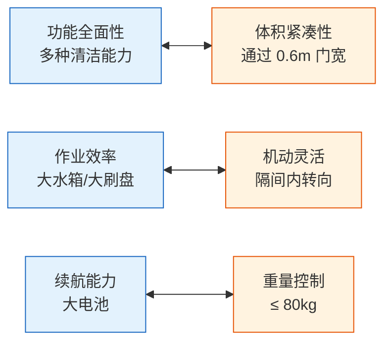
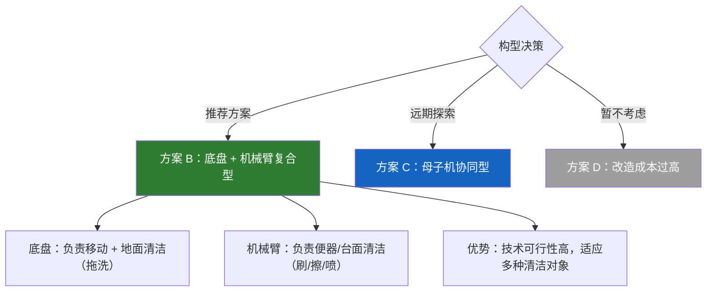
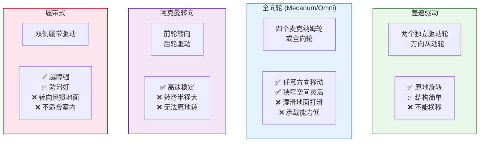
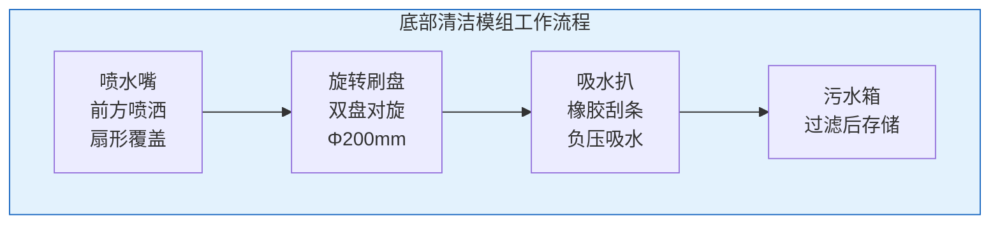
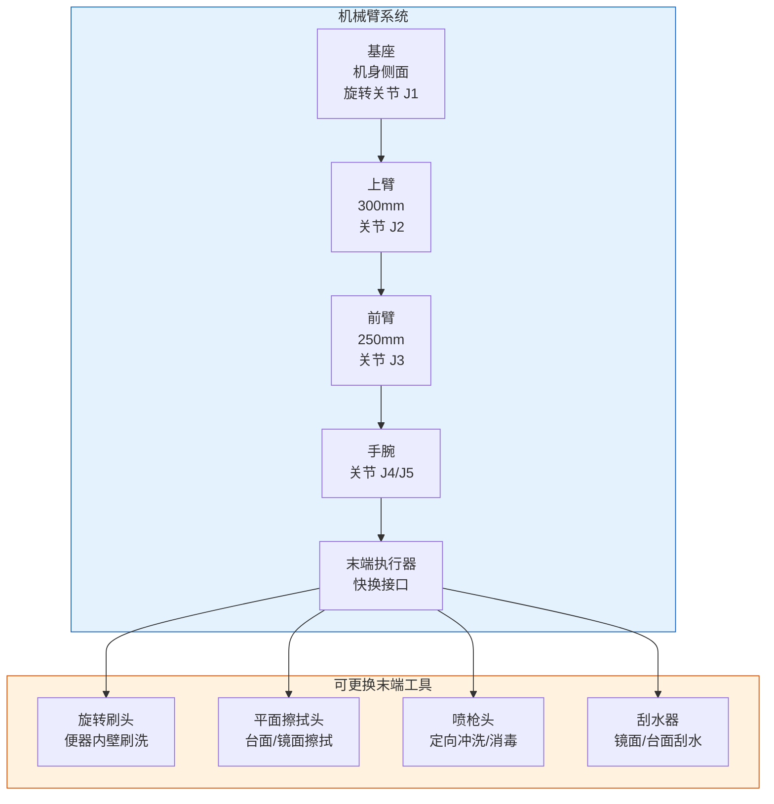
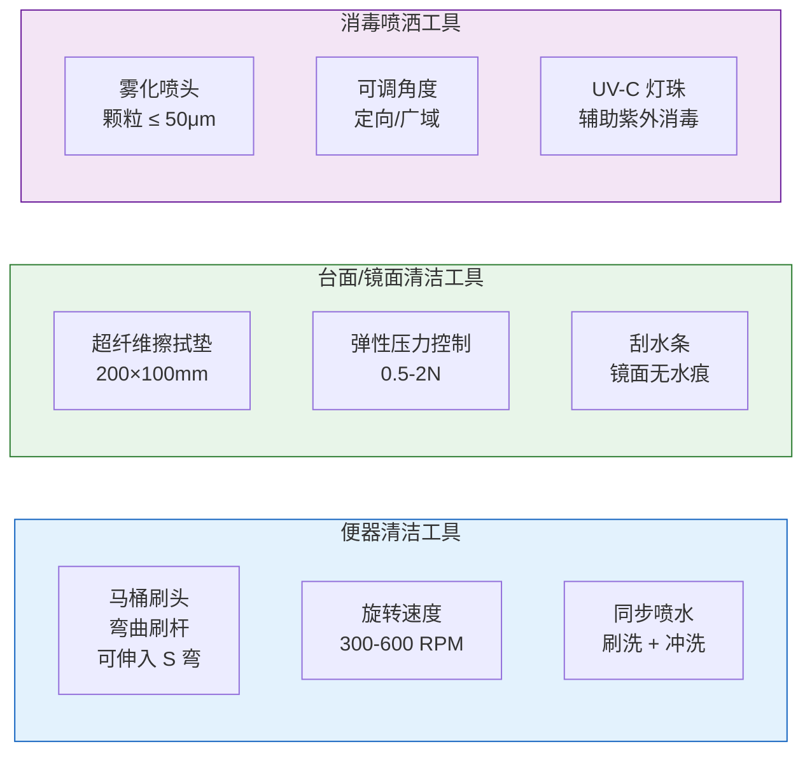
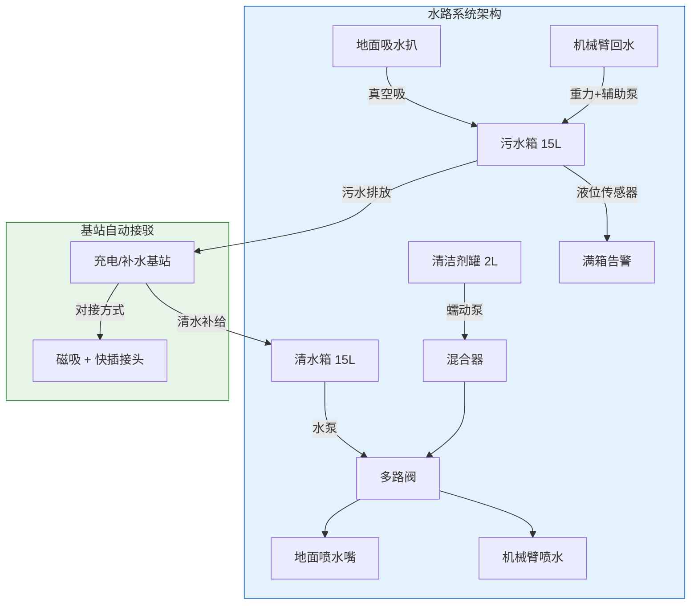
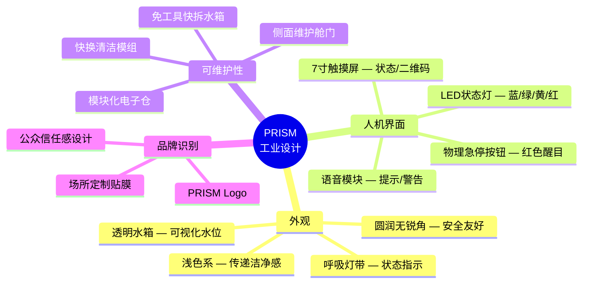
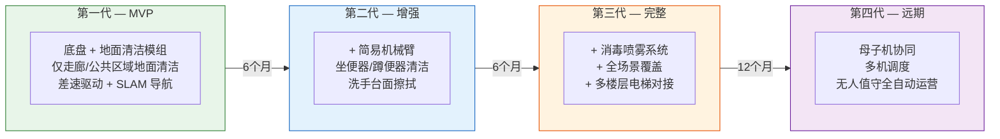

# 07 — 机器人形态探究

> 文档版本：v0.1.0 | 创建日期：2026-03-05 | 状态：草案
>
> 本文档探讨 PRISM 机器人的物理形态设计，涵盖整体构型、底盘方案、清洁机构、供水系统等关键决策。

---

## 1. 形态设计核心矛盾



**核心矛盾**：公共卫生间清洁需要的功能多、对象杂，但空间极度受限。这是 PRISM 区别于所有现有商用清洁机器人的最大设计挑战。

---

## 2. 整体构型方案对比

### 2.1 候选构型


### 2.2 构型评估矩阵

| 评估维度 | 方案 A<br/>一体车型 | 方案 B<br/>底盘+机械臂 | 方案 C<br/>母子机协同 | 方案 D<br/>轨道固定式 |
|---------|:---:|:---:|:---:|:---:|
| 隔间进入能力 | ★★★ | ★★★ | ★★★★★ | ★★★★ |
| 地面清洁能力 | ★★★★★ | ★★★★ | ★★★ | ★★ |
| 便器清洁能力 | ★ | ★★★★ | ★★★ | ★★★★ |
| 台面清洁能力 | ★ | ★★★★ | ★★ | ★★★ |
| 机动灵活性 | ★★★ | ★★★ | ★★★★★ | ★ |
| 部署成本 | ★★★★ | ★★★ | ★★★ | ★★ |
| 改造侵入性 | ★★★★★ | ★★★★★ | ★★★★ | ★ |
| 维护简便性 | ★★★★ | ★★★ | ★★ | ★★★★ |
| 技术成熟度 | ★★★★★ | ★★★ | ★★ | ★★★★ |
| **综合评分** | **3.4** | **3.6** | **3.2** | **2.8** |

### 2.3 构型决策



**决策理由**：
1. 方案 B 兼具地面清洁（底盘）和立体清洁（机械臂），功能覆盖最全
2. 底盘技术可复用成熟的商用清洁机器人方案，降低研发风险
3. 机械臂可分阶段开发 —— 首版实现地面清洁，二版加入机械臂便器清洁
4. 方案 C（母子机）作为远期优化方向保留，解决更极端的空间约束

---

## 3. 底盘方案设计

### 3.1 运动方案对比



### 3.2 底盘方案决策

| 维度 | 差速驱动 | 全向轮 | 阿克曼 | 履带 |
|------|:---:|:---:|:---:|:---:|
| 隔间转向 | ★★★★ | ★★★★★ | ★★ | ★★★ |
| 湿滑地面 | ★★★★ | ★★ | ★★★★ | ★★★★★ |
| 结构简单 | ★★★★★ | ★★★ | ★★★ | ★★★ |
| 承载能力 | ★★★★ | ★★★ | ★★★★★ | ★★★★★ |
| 成本 | ★★★★★ | ★★★ | ★★★★ | ★★★ |
| 地面友好 | ★★★★ | ★★★★ | ★★★★★ | ★★ |

**决策**：**差速驱动 + 防滑橡胶轮**

- 结构简单可靠，成本低
- 原地旋转满足隔间内调头需求
- 配合防滑纹路橡胶轮应对湿滑地面
- 前部增加一对万向从动轮保证稳定性（四轮触地）

### 3.3 底盘尺寸草案

```
        ┌───────────────────┐
        │   操作面板/屏幕    │  ← 高度约 1.0m
        ├───────────────────┤
        │   ┌───────────┐   │
        │   │  清水箱    │   │  ← 中部
        │   │  15L      │   │
        │   ├───────────┤   │
        │   │  污水箱    │   │
        │   │  15L      │   │
        │   └───────────┘   │
        │   机械臂折叠收纳   │  ← 侧面/背部
        ├───────────────────┤
        │  电池 + 控制单元   │  ← 底部
        │  ┌──┐  刷盘  ┌──┐ │
        │  │轮│  吸水  │轮│ │
        └──┴──┴────────┴──┴─┘
         ←── 0.50m ──→
         深度约 0.65m
```

| 参数 | 值 | 说明 |
|------|------|------|
| 长 × 宽 × 高 | 650mm × 500mm × 1000mm | 通过 600mm 门宽需留 50mm 余量 |
| 清水箱 | 15L | 上部放置，重心偏高需配重优化 |
| 污水箱 | 15L | 紧邻清水箱下方 |
| 电池仓 | 底部居中 | 降低重心 |
| 清洁模组 | 底部前方 | 可更换式设计 |
| 机械臂 | 侧面折叠 | 作业时展开，行进时收纳 |

---

## 4. 清洁机构设计

### 4.1 底部清洁模组（地面清洁）



| 组件 | 规格 | 说明 |
|------|------|------|
| 喷水嘴 | 扇形喷嘴 × 2 | 前方湿润地面，可混合清洁剂 |
| 旋转刷盘 | Φ200mm × 2（对旋） | 尼龙刷丝，转速 200-400 RPM 可调 |
| 吸水扒 | 宽度 400mm | 橡胶刮条 + 真空吸水，确保地面无积水 |
| 吸水电机 | 真空度 ≥ 15kPa | 涡流风机 |
| 清洁剂罐 | 2L | 可自动配比浓度 |

### 4.2 机械臂清洁模组（立体清洁）



| 参数 | 值 | 说明 |
|------|------|------|
| 自由度 | 5 DOF | J1 旋转 + J2/J3 俯仰 + J4/J5 手腕 |
| 工作半径 | ≥ 550mm | 覆盖坐便器内壁/洗手台面 |
| 末端负载 | ≥ 1.5kg | 含刷头 + 电机 + 水管 |
| 重复定位精度 | ≤ 5mm | 卫生间清洁不需要工业级精度 |
| 防护等级 | IP65 | 关节防水密封 |
| 快换接口 | 电动/气动锁止 | 30 秒内更换末端工具 |

### 4.3 末端工具详情



---

## 5. 供水与排水系统



---

## 6. 充电与能源系统

| 参数 | 规格 | 说明 |
|------|------|------|
| 电池类型 | 磷酸铁锂（LiFePO₄） | 安全性高、循环寿命长（≥ 2000 次） |
| 电池容量 | 48V / 30Ah（1.44kWh） | 支撑 ≥ 2 小时连续作业 |
| 充电方式 | 自动对接式充电（触点/无线） | 回基站自动充电 |
| 充电功率 | 500W | 满充约 3 小时 |
| BMS | 过充/过放/过温保护 | 安全等级符合 GB 31241 |
| 低电量策略 | ≤ 15% 自动返回充电 | 规划返回路径，确保不中途断电 |

---

## 7. 工业设计原则



### 7.1 状态指示灯定义

| 灯效 | 颜色 | 含义 |
|------|------|------|
| 呼吸闪烁 | 蓝色 | 待机/空闲 |
| 常亮流转 | 绿色 | 正在清洁作业 |
| 缓慢闪烁 | 黄色 | 需要维护（缺水/满污/工具磨损） |
| 快速闪烁 | 红色 | 故障/急停 |
| 彩虹流转 | 多色 | 清洁完成展示（可选，提升品牌感） |

---

## 8. 分阶段形态演进路线



---

> 上一篇：[06-机器人需求分析](06-机器人需求分析.md) | 下一篇：[08-机器人功能定义与系统架构](08-机器人功能定义与系统架构.md)
