# 08 — 机器人功能定义与系统架构

> 文档版本：v0.1.0 | 创建日期：2026-03-05 | 状态：草案
>
> 本文档定义 PRISM 机器人各子系统的功能划分和整体软硬件架构。

---

## 1. 子系统总览

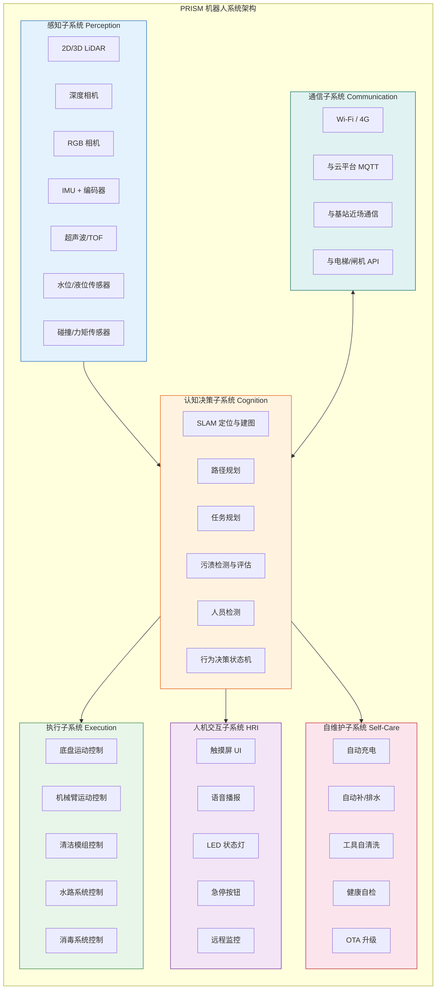

---

## 2. 感知子系统（Perception）

### 2.1 传感器融合架构

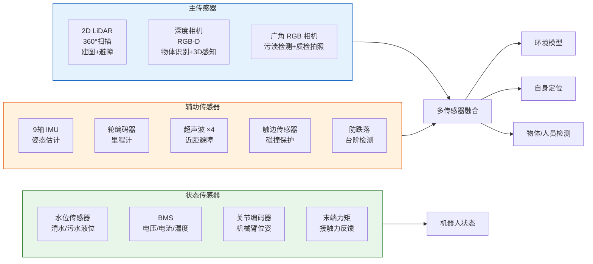

### 2.2 感知功能明细

| 功能 | 传感器 | 算法 | 输出 | 频率 |
|------|--------|------|------|------|
| 定位 | LiDAR + IMU + 编码器 | AMCL / Cartographer | 机器人位姿 (x, y, θ) | 20 Hz |
| 建图 | LiDAR + 深度相机 | GMapping / Cartographer | 2D 栅格地图 + 3D 语义地图 | 建图阶段 |
| 障碍物检测 | LiDAR + 超声波 + 深度相机 | 点云聚类 + 深度图滤波 | 障碍物列表 (位置, 尺寸) | 10 Hz |
| 人员检测 | RGB 相机 + 深度相机 | YOLOv8 + 人体骨骼检测 | 人员位置 + 距离 | 15 Hz |
| 污渍检测 | RGB 相机 | 语义分割（自训练模型） | 污渍类型 + 区域 + 严重度 | 5 Hz |
| 门/隔间识别 | 深度相机 + RGB | 3D 平面检测 + 标志识别 | 门位置/状态（开/关/半开） | 5 Hz |
| 洁具识别 | RGB-D | 3D 物体检测 | 便器/台面/水龙头 3D 位姿 | 按需 |
| 清洁质量评估 | RGB 相机 | 清洁前后图像对比 | 清洁度评分 (0-100) | 按需 |
| 碰撞保护 | 触边传感器 + 力矩 | 阈值触发 | 碰撞事件 → 急停 | 实时 |
| 跌落保护 | 红外防跌落 × 4 | 距离阈值 | 台阶/坑洞 → 急停 | 实时 |

---

## 3. 认知决策子系统（Cognition）

### 3.1 导航系统

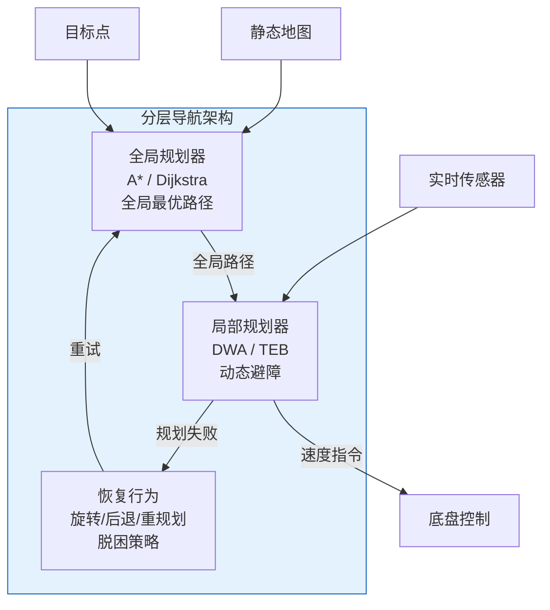

### 3.2 卫生间特化导航策略

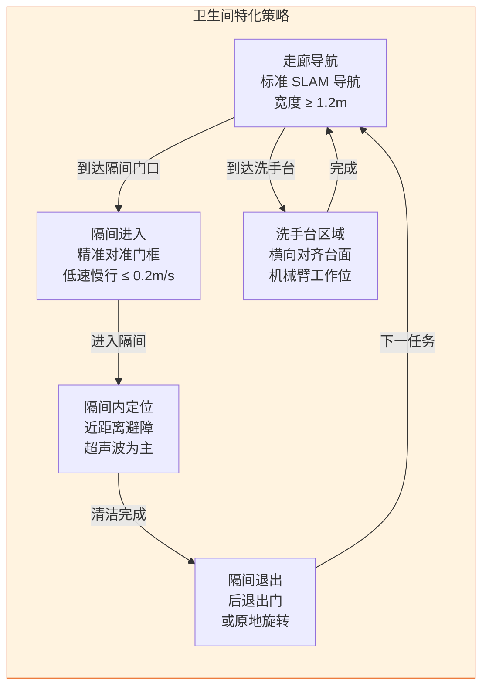

### 3.3 任务规划

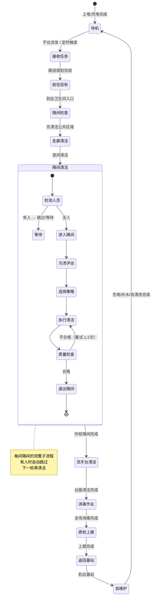

### 3.4 行为决策状态机

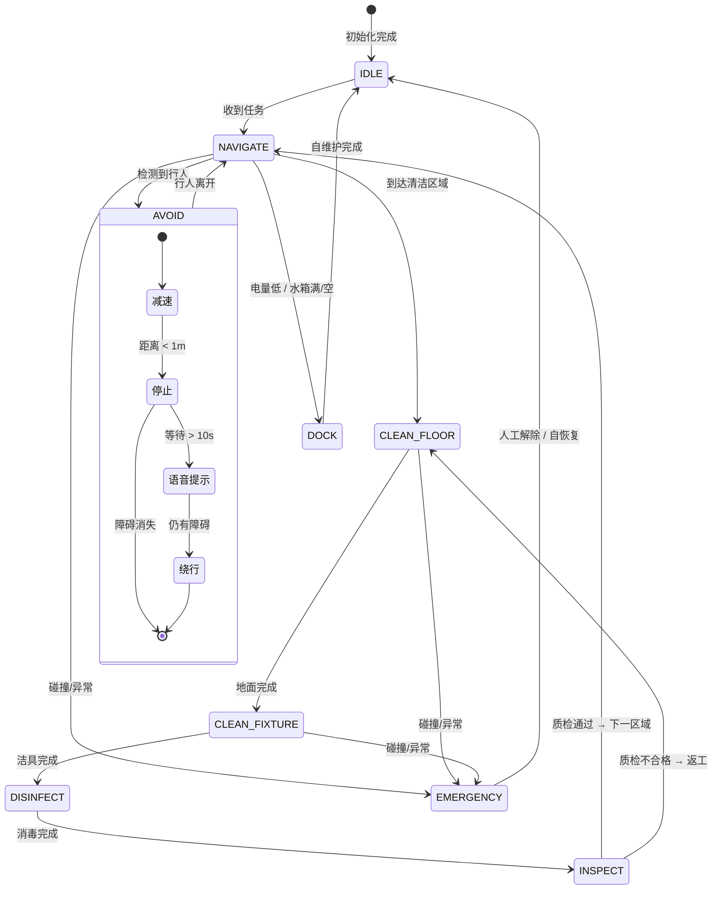

---

## 4. 执行子系统（Execution）

### 4.1 底盘运动控制

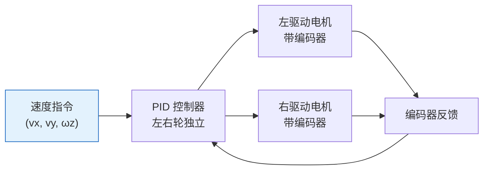

| 参数 | 值 |
|------|------|
| 控制频率 | 50 Hz |
| 最大线速度 | 1.0 m/s |
| 最大角速度 | 1.5 rad/s |
| 清洁模式速度 | 0.2-0.4 m/s |
| 加速度限制 | ≤ 0.5 m/s² |

### 4.2 机械臂运动控制

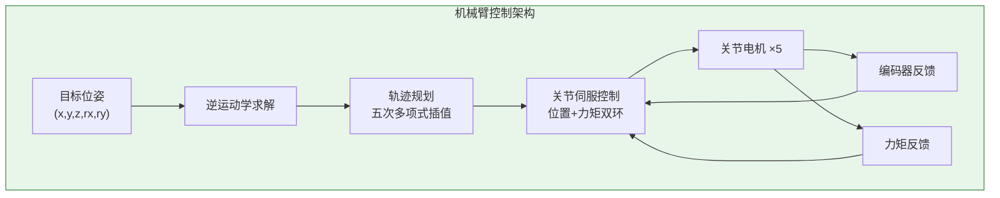

**关键控制模式**：

| 模式 | 场景 | 控制策略 |
|------|------|---------|
| 位置控制 | 移动到预定义位置 | PID 位置环 |
| 力控/柔顺控制 | 擦拭台面、刷洗便器 | 阻抗控制 — 维持恒定接触力 |
| 示教-回放 | 学习新卫生间布局 | 拖动示教 + 轨迹记录 |
| 安全限位 | 防止碰撞 | 关节限位 + 力矩阈值急停 |

### 4.3 清洁作业编排

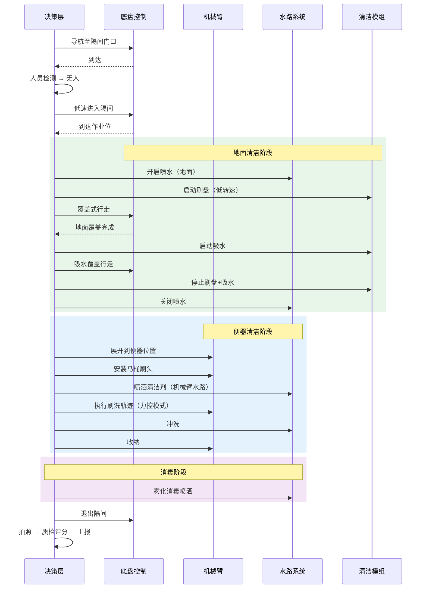

---

## 5. 人机交互子系统（HRI）

### 5.1 交互方式

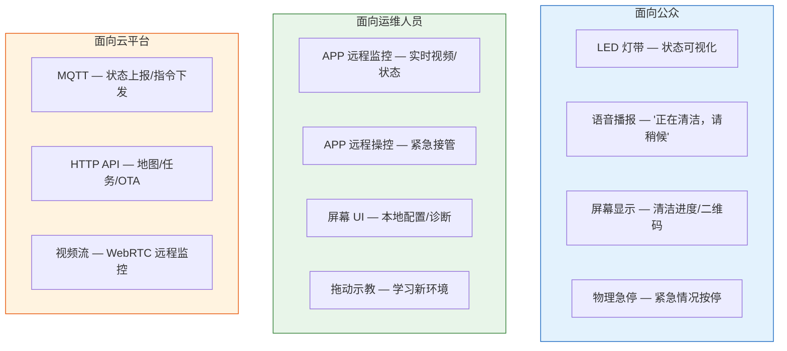

### 5.2 安全交互协议

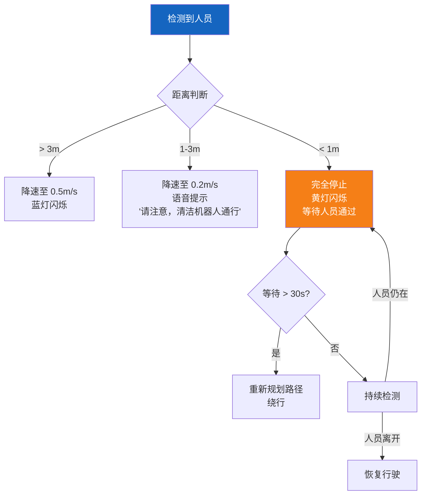

---

## 6. 自维护子系统（Self-Care）

### 6.1 基站功能

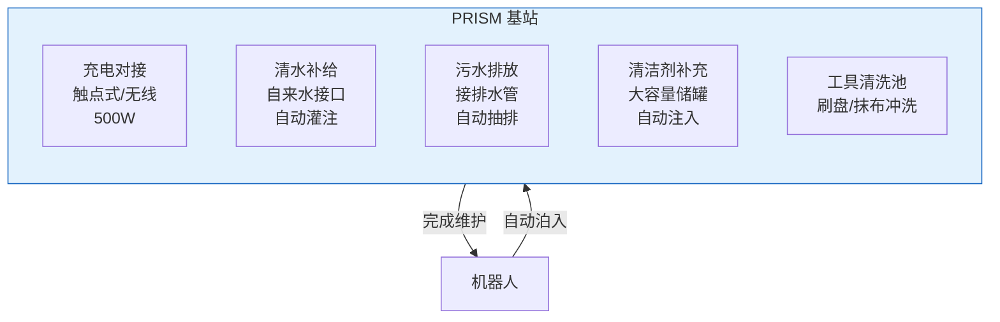

### 6.2 自维护流程

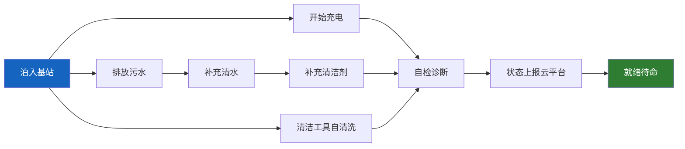

### 6.3 健康自检项目

| 检查项 | 检查方式 | 频率 | 异常处理 |
|--------|---------|------|---------|
| 电池健康 | BMS 数据分析 | 每次充电 | SOH < 80% 告警 |
| 刷盘磨损 | 电流异常检测 | 每次作业 | 磨损严重 → 提醒更换 |
| 吸水电机 | 真空度检测 | 每次作业 | 真空度下降 → 检查堵塞 |
| LiDAR 状态 | 自检信号 | 开机 | 异常 → 降级到超声波模式 |
| 相机状态 | 测试图像 | 开机 | 镜头污染 → 提醒擦拭 |
| 机械臂关节 | 零位标定偏差 | 开机 | 偏差过大 → 重新标定 |
| 网络连接 | Ping 测试 | 持续 | 断网 → 离线模式运行 |
| 水路管路 | 流量/压力 | 每次作业 | 堵塞/泄漏 → 告警 |

---

## 7. 软件架构

### 7.1 机器人端软件分层

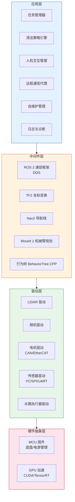

### 7.2 ROS 2 节点拓扑

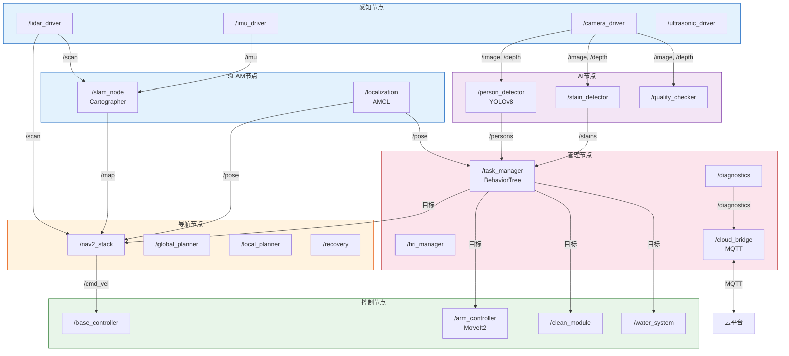

---

## 8. 机器人与云平台交互

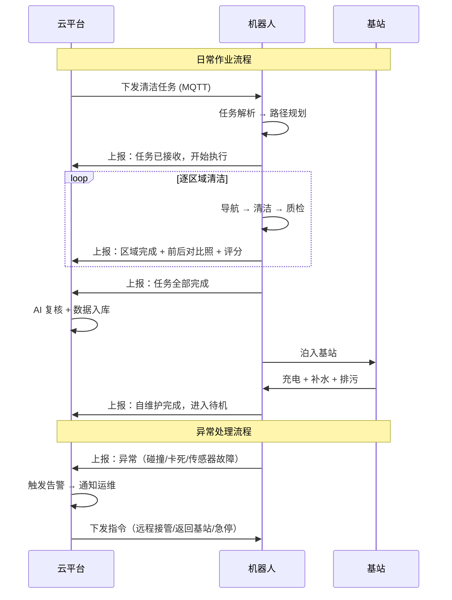

---

> 上一篇：[07-机器人形态探究](07-机器人形态探究.md) | 下一篇：[09-机器人技术选型](09-机器人技术选型.md)
