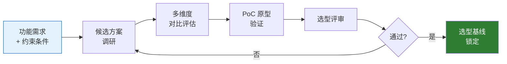
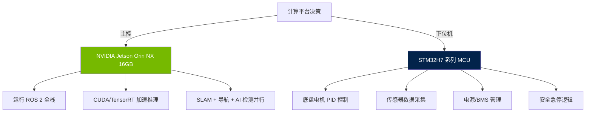
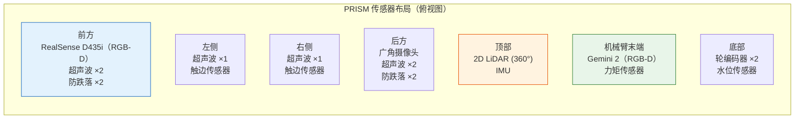
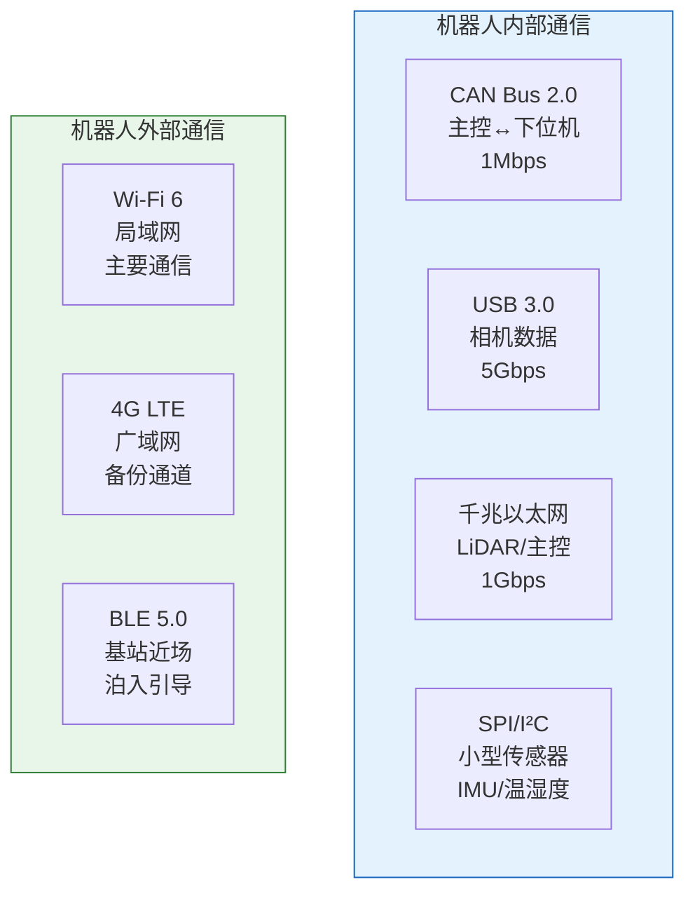
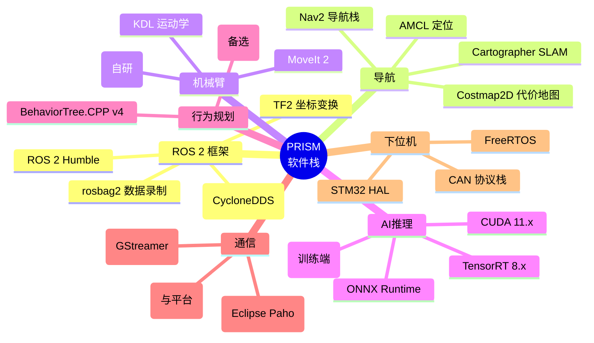

# 09 — 机器人技术选型

> 文档版本：v0.1.0 | 创建日期：2026-03-05 | 状态：草案
>
> 本文档记录 PRISM 机器人硬件和嵌入式软件层面的技术选型决策。

---

## 1. 技术选型总流程

---

## 2. 计算平台选型

### 2.1 候选方案

| 方案 | 芯片 | CPU | GPU/NPU | 功耗 | 价格(¥) | 生态 |
|------|------|-----|---------|------|---------|------|
| NVIDIA Jetson Orin NX 16GB | Orin | 8 核 Cortex-A78AE | 1024 CUDA + 2 NVDLA (100 TOPS) | 15-25W | ~4000 | ROS 2 + CUDA + TensorRT 完善 |
| NVIDIA Jetson Orin Nano 8GB | Orin | 6 核 Cortex-A78AE | 1024 CUDA (40 TOPS) | 7-15W | ~2000 | 同上，算力较低 |
| RK3588 | 瑞芯微 | 4×A76 + 4×A55 | Mali G610 + 6 TOPS NPU | 5-10W | ~500 | Linux + RKNN，ROS 2 可用 |
| 地平线 J5 | 征程 5 | 8×A55 | BPU (128 TOPS) | 15-30W | ~3000 | 专注自动驾驶，机器人生态弱 |
| Intel NUC (x86) | i7-1365U | 10 核 x86 | Intel Arc 集显 | 28-45W | ~4000 | x86 完整生态，功耗大 |

### 2.2 决策

**选型理由**：

| 决策 | 理由 |
|------|------|
| 主控选 Jetson Orin NX | 100 TOPS AI 算力满足多路推理需求；CUDA 生态成熟；ROS 2 官方支持；功耗可控（15-25W） |
| 下位机选 STM32H7 | 双核 Cortex-M7（480MHz）实时性强；CAN/SPI 接口丰富；电机控制 + 安全逻辑分离到下位机，提高可靠性 |
| 上下位机通信 | CAN Bus（实时控制指令）+ USB/UART（诊断数据） |

---

## 3. 传感器选型

### 3.1 LiDAR

| 方案 | 型号 | 类型 | 扫描角 | 量程 | 精度 | 价格(¥) |
|------|------|------|--------|------|------|---------|
| 思岚 RPLIDAR A3 | A3 | 2D 三角法 | 360° | 25m | ±3mm | ~1800 |
| 思岚 RPLIDAR S2L | S2L | 2D TOF | 360° | 30m | ±3cm | ~2500 |
| 速腾 RS-Helios 16 | Helios-16 | 3D 16线 | 360°×30° | 100m | ±2cm | ~8000 |
| Livox Mid-360 | Mid-360 | 3D 半固态 | 360°×59° | 40m | ±2cm | ~4000 |

**决策**：**思岚 RPLIDAR S2L（2D）+ 深度相机补充 3D**

- 室内 2D SLAM 足够（单层平面环境）
- S2L 的 TOF 方案在强光/弱光下都稳定
- 3D 感知通过深度相机补充，不需要昂贵的 3D LiDAR
- 如隔间内近距离场景，超声波兜底

### 3.2 相机

| 方案 | 型号 | 类型 | 分辨率 | 视角 | 深度范围 | 价格(¥) |
|------|------|------|--------|------|---------|---------|
| Intel RealSense D435i | D435i | 双目结构光 | 1280×720 | 87°×58° | 0.1-10m | ~2500 |
| Intel RealSense D456 | D456 | 主动红外立体 | 1280×720 | 87°×58° | 0.2-6m | ~3000 |
| 奥比中光 Gemini 2 | Gemini 2 | 双目结构光 | 1280×800 | 90°×75° | 0.15-10m | ~1500 |
| OAK-D Pro | OAK-D Pro | 双目 + ToF | 4K (RGB) | 95°×70° | 0.2-35m | ~3000 |

**决策**：

| 位置 | 选型 | 用途 |
|------|------|------|
| 前方（正前下倾 30°） | **Intel RealSense D435i** | 导航避障 + 地面污渍检测 + 门/隔间识别 |
| 机械臂末端 | **奥比中光 Gemini 2** | 近距离便器/台面定位 + 清洁质量检测 |
| 后方 | **广角 USB 摄像头（200W 像素）** | 倒车安全 + 后方障碍检测 |

### 3.3 IMU

**决策**：**BMI088**（博世）

- 6 轴（3 加速度 + 3 陀螺仪），精度满足室内导航
- 内置温度补偿
- ROS 2 驱动成熟
- 价格低（~50 元）

### 3.4 超声波传感器

**决策**：**HC-SR04 升级版（防水型）× 6**

- 前方 2 + 左右各 1 + 后方 2
- 量程 3cm-4m，覆盖近距离盲区
- IP67 防水型号适应卫生间环境
- 单价 ~30 元

### 3.5 传感器布局总图

---

## 4. 驱动系统选型

### 4.1 底盘驱动

| 参数 | 选型 | 说明 |
|------|------|------|
| 驱动电机 | 直流无刷电机（BLDC）× 2 | 额定功率 100W，带编码器 |
| 减速比 | 行星减速器 1:30 | 低速大扭矩 |
| 驱动器 | ODrive / SimpleFOC 方案 | CAN 总线控制 |
| 驱动轮 | Φ150mm 防滑橡胶轮 | 防水、耐腐蚀 |
| 从动轮 | 万向轮 × 2 | 前方支撑，不锈钢材质 |

### 4.2 机械臂驱动

| 关节 | 电机类型 | 扭矩 | 说明 |
|------|---------|------|------|
| J1（基座旋转） | 一体化关节模组 | 10 Nm | 含电机+减速器+编码器+驱动 |
| J2（上臂俯仰） | 一体化关节模组 | 15 Nm | 主要承重关节 |
| J3（前臂俯仰） | 一体化关节模组 | 8 Nm | — |
| J4（手腕旋转） | 伺服电机 | 3 Nm | — |
| J5（手腕俯仰） | 伺服电机 | 3 Nm | — |

**推荐方案**：采用大疆 RoboMaster 关节模组或 Unitree 关节电机等国产一体化方案，降低集成难度。

### 4.3 清洁模组驱动

| 组件 | 电机 | 功率 | 说明 |
|------|------|------|------|
| 旋转刷盘 × 2 | 有刷直流电机 | 50W × 2 | 转速 200-400 RPM，PWM 调速 |
| 吸水风机 | 无刷直流电机 | 100W | 真空度 ≥ 15kPa |
| 水泵（喷水） | 隔膜泵 | 30W | 流量 2L/min，压力 0.3MPa |
| 蠕动泵（清洁剂） | 步进电机驱动 | 5W | 精确控制浓度 |
| 末端刷头电机 | 有刷直流 | 20W | 机械臂末端小型化 |

---

## 5. 通信选型

| 通信 | 选型 | 场景 | 协议 |
|------|------|------|------|
| 上下位机 | CAN Bus 2.0 | 电机控制、传感器、急停 | CANOpen / 自定义 |
| 相机 | USB 3.0 | RGB-D 数据传输 | UVC |
| LiDAR | 以太网 / USB | 点云数据 | 厂商 SDK |
| 云平台 | Wi-Fi 6 | 任务下发/状态上报 | MQTT over TLS |
| 远程视频 | Wi-Fi 6 | 监控/远程操控 | WebRTC |
| 备份网络 | 4G LTE | Wi-Fi 不可用时 | MQTT over TLS |
| 基站对接 | BLE 5.0 | 精确泊入引导 | GATT 自定义 |

---

## 6. 嵌入式软件选型

### 6.1 操作系统

| 层级 | 选型 | 说明 |
|------|------|------|
| 主控 OS | **Ubuntu 22.04 LTS + ROS 2 Humble** | LTS 稳定版，ROS 2 Humble 官方支持到 2027 |
| 实时补丁 | **PREEMPT-RT 内核** | 降低导航/控制延迟 |
| 下位机 RTOS | **FreeRTOS** | STM32 生态最成熟 |
| 容器化 | **Docker** | 应用隔离、OTA 升级便捷 |

### 6.2 核心软件栈

---

## 7. 物料成本估算（BOM）

| 类别 | 物料 | 数量 | 单价(¥) | 小计(¥) |
|------|------|------|--------|---------|
| **计算** | Jetson Orin NX 16GB | 1 | 4,000 | 4,000 |
| | STM32H743 开发板 | 1 | 300 | 300 |
| **传感器** | RPLIDAR S2L | 1 | 2,500 | 2,500 |
| | RealSense D435i | 1 | 2,500 | 2,500 |
| | 奥比中光 Gemini 2 | 1 | 1,500 | 1,500 |
| | 广角摄像头 | 1 | 200 | 200 |
| | BMI088 IMU | 1 | 50 | 50 |
| | 超声波（防水型）| 6 | 30 | 180 |
| | 其他传感器（水位/温湿度/电流等） | — | — | 500 |
| **驱动** | 底盘 BLDC 电机 + 驱动器 | 2 | 800 | 1,600 |
| | 机械臂关节模组 | 5 | 1,500 | 7,500 |
| | 末端执行器 + 快换 | 1 | 2,000 | 2,000 |
| **清洁** | 刷盘电机 + 刷盘 | 2 | 200 | 400 |
| | 吸水风机 | 1 | 300 | 300 |
| | 水泵 + 蠕动泵 | 2 | 200 | 400 |
| | 喷嘴 + 管路 + 阀 | — | — | 500 |
| **结构** | 底盘框架（铝合金/不锈钢） | 1 | 3,000 | 3,000 |
| | 外壳（工程塑料注塑/CNC） | 1 | 5,000 | 5,000 |
| | 水箱（清水+污水）| 2 | 500 | 1,000 |
| | 轮子 + 减速器 | — | — | 800 |
| **电源** | 48V/30Ah 磷酸铁锂电池 | 1 | 3,000 | 3,000 |
| | BMS 模块 | 1 | 500 | 500 |
| | 电源管理板 | 1 | 300 | 300 |
| **通信** | Wi-Fi 6 模块 | 1 | 100 | 100 |
| | 4G LTE 模块 | 1 | 200 | 200 |
| **人机** | 7 寸触摸屏 | 1 | 500 | 500 |
| | 扬声器 + 功放 | 1 | 100 | 100 |
| | LED 灯带 + 急停按钮 | — | — | 200 |
| **线缆/连接器/紧固件** | 杂项 | — | — | 2,000 |
| | **合计** | | | **~41,130** |

> 注：以上为小批量（10 台）采购估价。量产后可优化至 3-3.5 万元。基站另计约 5,000 元。

---

## 8. 技术选型风险与缓解

| 风险 | 概率 | 影响 | 缓解措施 |
|------|------|------|---------|
| Jetson Orin 算力不足以支撑多模型并行 | 中 | 高 | 模型量化（INT8/FP16）；分优先级调度；备选加 RK3588 协处理 |
| 机械臂防水密封失效 | 中 | 高 | 选用 IP65+ 关节；关键位置加 O-ring 密封；定期检查 |
| 刷盘寿命不足 | 高 | 中 | 设计快换结构；监控电流判断磨损；备件库存 |
| ROS 2 实时性不满足控制需求 | 低 | 高 | 安全相关逻辑下沉到 STM32 MCU；上位机仅做规划 |
| Wi-Fi 在地下场所不稳定 | 中 | 中 | 4G LTE 备份；离线模式缓存任务 |
| 电池在高湿环境下性能衰减 | 中 | 中 | IP67 密封电池仓；BMS 加湿度传感器；异常告警 |

---

## 9. 选型决策记录（ADR）

### ADR-R01：主控选择 Jetson Orin NX

- **状态**：已决策
- **理由**：GPU 算力 + CUDA 生态 + ROS 2 官方支持的唯一高性价比方案
- **备选**：RK3588（算力不足）、x86 NUC（功耗过高）

### ADR-R02：SLAM 方案选择 Cartographer

- **状态**：已决策
- **理由**：Google 开源，2D/3D 都支持；Loop Closure 回环检测强；CPU 友好
- **备选**：GMapping（无回环）、ORB-SLAM3（纯视觉，室内弱纹理差）

### ADR-R03：行为规划选择 BehaviorTree.CPP

- **状态**：已决策
- **理由**：比状态机更适合复杂任务编排；可视化调试（Groot2）；Nav2 原生集成
- **备选**：SMACH（Python，性能差）、自研状态机（开发量大）

### ADR-R04：机械臂规划选择 MoveIt 2

- **状态**：已决策
- **理由**：ROS 2 标准方案；碰撞检测 + 轨迹规划完善；社区活跃
- **备选**：自研 IK 求解器（5DOF 相对简单，可作为降级方案）

---

> 上一篇：[08-机器人功能定义与系统架构](08-机器人功能定义与系统架构.md) | 下一篇：[10-机器人研发规划与里程碑](10-机器人研发规划与里程碑.md)
