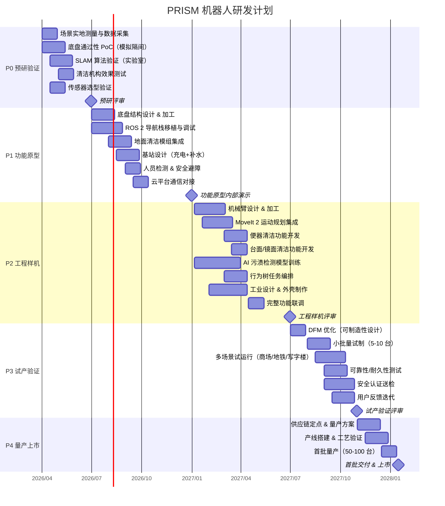
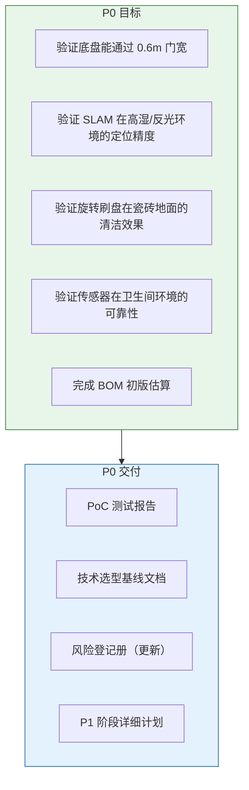
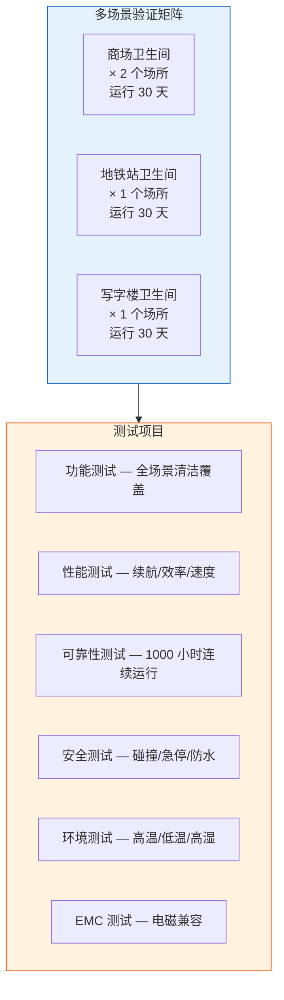
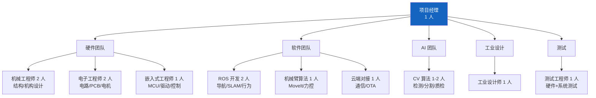
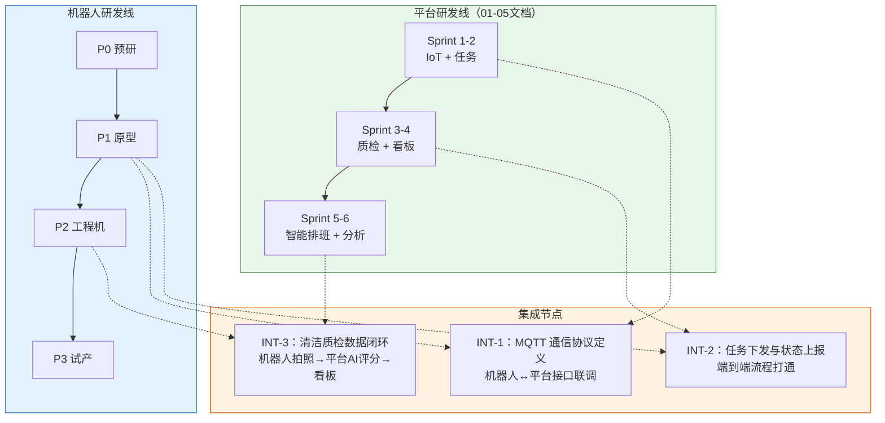

# 10 — 机器人研发规划与里程碑

> 文档版本：v0.1.0 | 创建日期：2026-03-05 | 状态：草案
>
> 本文档规划 PRISM 机器人从原型到量产的全生命周期研发路线。

---

## 1. 研发阶段总览

```mermaid
flowchart LR
    subgraph P0["P0 — 预研验证<br/>3 个月"]
        direction TB
        P0A["核心技术预研"]
        P0B["关键部件选型验证"]
        P0C["概念原型 Demo"]
    end

    subgraph P1["P1 — 功能原型<br/>6 个月"]
        direction TB
        P1A["底盘导航系统"]
        P1B["地面清洁功能"]
        P1C["基站自维护"]
        P1D["云平台对接"]
    end

    subgraph P2["P2 — 工程样机<br/>6 个月"]
        direction TB
        P2A["机械臂集成"]
        P2B["便器/台面清洁"]
        P2C["AI 污渍检测"]
        P2D["工业设计定型"]
    end

    subgraph P3["P3 — 试产验证<br/>4 个月"]
        direction TB
        P3A["小批量试制 (5-10 台)"]
        P3B["多场景试运行"]
        P3C["可靠性测试"]
        P3D["认证送检"]
    end

    subgraph P4["P4 — 量产上市<br/>3 个月"]
        direction TB
        P4A["供应链搭建"]
        P4B["量产产线建设"]
        P4C["首批交付"]
    end

    P0 -->|M1| P1 -->|M2| P2 -->|M3| P3 -->|M4| P4

    style P0 fill:#e8f5e9,stroke:#2e7d32
    style P1 fill:#e3f2fd,stroke:#1565c0
    style P2 fill:#fff3e0,stroke:#e65100
    style P3 fill:#f3e5f5,stroke:#6a1b9a
    style P4 fill:#fce4ec,stroke:#b71c1c
```

---

## 2. 详细甘特图

---

## 3. 里程碑定义

| 里程碑 | 名称 | 时间 | 关键交付物 | Gate 评审标准 |
|--------|------|------|-----------|-------------|
| **M1** | 预研完成 | 2026-06 | PoC 报告、选型方案、风险评估 | 核心技术风险可控 |
| **M2** | 功能原型 | 2026-12 | 可导航+地面清洁的原型机 | 走廊导航成功率 ≥ 95%，地面清洁覆盖率 ≥ 90% |
| **M3** | 工程样机 | 2027-06 | 全功能工程机 + 工业外观 | 隔间进入 ≥ 90%，便器清洁合格率 ≥ 80%，MTBF ≥ 200h |
| **M4** | 试产验证 | 2027-10 | 多场景验证报告、认证证书 | 连续 30 天运行无严重故障、用户满意度 ≥ 3.5/5 |
| **M5** | 量产上市 | 2028-01 | 量产产品、商务资料 | 产线良率 ≥ 95%，BOM 成本达标 |

---

## 4. 各阶段详细目标

### 4.1 P0 — 预研验证（2026 Q2）

### 4.2 P1 — 功能原型（2026 Q3-Q4）

**核心交付**：一台可以在真实卫生间走廊自主导航并清洁地面的原型机。

| 功能 | 完成度目标 | 验收方式 |
|------|-----------|---------|
| SLAM 建图 | 卫生间全区域建图 | 人工确认地图完整度 |
| 自主导航 | 走廊导航成功率 ≥ 95% | 100 次导航测试 |
| 地面清洁 | 覆盖率 ≥ 90% | 网格法测量 |
| 人员避障 | 检测距离 ≥ 2m | 10 人次测试 |
| 自动充电 | 回充成功率 ≥ 95% | 50 次对接测试 |
| 云平台通信 | 任务收发正常 | 端到端测试 |

### 4.3 P2 — 工程样机（2027 Q1-Q2）

**核心交付**：全功能工程机，具备完整清洁能力和工业化外观。

| 新增功能 | 完成度目标 |
|---------|-----------|
| 隔间进入 | 进入成功率 ≥ 90% |
| 便器清洁 | 清洁合格率 ≥ 80% |
| 台面清洁 | 清洁合格率 ≥ 85% |
| AI 污渍检测 | 检测准确率 ≥ 80% |
| 消毒喷洒 | 覆盖率 ≥ 85% |
| 自动补/排水 | 成功率 ≥ 95% |
| 续航 | ≥ 2 小时连续作业 |

### 4.4 P3 — 试产验证（2027 Q3-Q4）

### 4.5 P4 — 量产上市（2028 Q1）

| 工作项 | 说明 |
|--------|------|
| 供应链管理 | 核心器件定点 2 家以上供应商 |
| 产线设计 | 组装 → 调试 → 老化 → 检测 → 包装 |
| 质量体系 | IQC/IPQC/OQC 全流程质检 |
| 售后体系 | 备件清单、维修手册、远程诊断流程 |
| 商务准备 | 定价策略、销售资料、案例包装 |

---

## 5. 团队配置

| 阶段 | 团队规模 | 说明 |
|------|---------|------|
| P0 预研 | 5-6 人 | 核心人员 + 外协 |
| P1 原型 | 8-10 人 | 全职团队组建 |
| P2 工程机 | 12-15 人 | 峰值人力 |
| P3 试产 | 10-12 人 | 减少研发，增加测试/产线 |
| P4 量产 | 8-10 人 | 维持研发 + 增加生产/售后 |

---

## 6. 预算估算

| 阶段 | 人力成本(万元) | 硬件/物料(万元) | 工具/设备(万元) | 外协/认证(万元) | 合计(万元) |
|------|---------------|----------------|----------------|----------------|-----------|
| P0 预研 | 30 | 10 | 5 | 5 | **50** |
| P1 原型 | 80 | 30 | 10 | 10 | **130** |
| P2 工程机 | 120 | 50 | 15 | 15 | **200** |
| P3 试产 | 80 | 80 | 10 | 30 | **200** |
| P4 量产 | 50 | 100 | 20 | 10 | **180** |
| **总计** | **360** | **270** | **60** | **70** | **760** |

---

## 7. 风险登记册（机器人专项）

| ID | 风险 | 概率 | 影响 | 等级 | 缓解措施 | Owner |
|----|------|------|------|------|---------|-------|
| RR-01 | 底盘无法可靠通过 0.6m 门宽 | 中 | 高 | 高 | P0 阶段重点验证；备选瘦身方案 | 机械 Lead |
| RR-02 | 湿滑地面 SLAM 定位漂移 | 中 | 高 | 高 | 多传感器融合；IMU 补偿；视觉辅助 | ROS Lead |
| RR-03 | 机械臂在狭窄隔间碰撞 | 高 | 中 | 高 | MoveIt 碰撞检测；力矩阈值保护；降速运动 | 臂算法 |
| RR-04 | 防水密封失效导致电子故障 | 中 | 高 | 高 | IP67 设计 + 关键区域双重密封 + 老化测试 | 结构工程师 |
| RR-05 | 清洁效果不达预期 | 中 | 高 | 高 | 多种刷头迭代测试；与保洁行业专家合作 | 机构工程师 |
| RR-06 | AI 模型泛化能力差 | 中 | 中 | 中 | 多场景数据采集；数据增强；持续学习 | AI Lead |
| RR-07 | 电池在高湿环境衰减快 | 低 | 中 | 中 | 密封电池仓 + BMS 监控 + 定期健康评估 | 电子工程师 |
| RR-08 | 机械臂关节模组供应不稳 | 中 | 中 | 中 | 定点 2 家供应商；库存安全余量 | PM |
| RR-09 | 安全认证周期过长 | 中 | 中 | 中 | 提前启动认证沟通；设计阶段遵循标准 | PM |
| RR-10 | 用户（运维/公众）接受度低 | 低 | 高 | 中 | P3 试运行深度用户调研；产品体验优化 | PM + 工业设计 |

---

## 8. 关键路径分析

**关键路径**：底盘 → SLAM → 机械臂 → 便器清洁 → 联调 → 验证认证

关键路径上的任何延迟都将直接影响最终交付时间。需重点关注：
1. **底盘加工周期** — 提前与供应商沟通排期
2. **机械臂设计** — P1 阶段即启动概念设计
3. **场景验证 + 认证** — 并行推进，不串行等待

---

## 9. 机器人与平台研发协同

**关键集成协议（需提前定义）**：

| 协议 | 方向 | 内容 | 优先定义时间 |
|------|------|------|------------|
| 任务下发 | 平台 → 机器人 | 任务类型、区域、优先级、清洁策略 | P0 阶段 |
| 状态上报 | 机器人 → 平台 | 位置、电量、水量、作业状态、错误码 | P0 阶段 |
| 质检数据 | 机器人 → 平台 | 清洁前后照片、自评分、传感器数据 | P1 阶段 |
| 远程控制 | 平台 → 机器人 | 急停、暂停、恢复、返回基站 | P1 阶段 |
| 地图管理 | 双向 | 地图上传/下载、区域标注 | P1 阶段 |
| OTA 升级 | 平台 → 机器人 | 固件包推送、升级状态回报 | P2 阶段 |

---

> 上一篇：[09-机器人技术选型](09-机器人技术选型.md) | 首页：[00-项目概述与总体流程](../platform/00-项目概述与总体流程.md)
